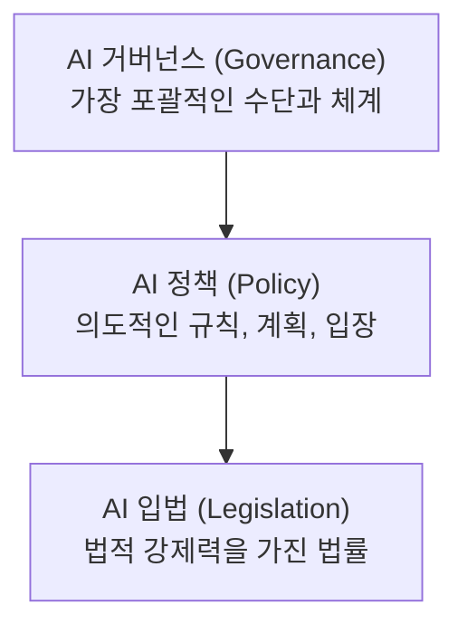
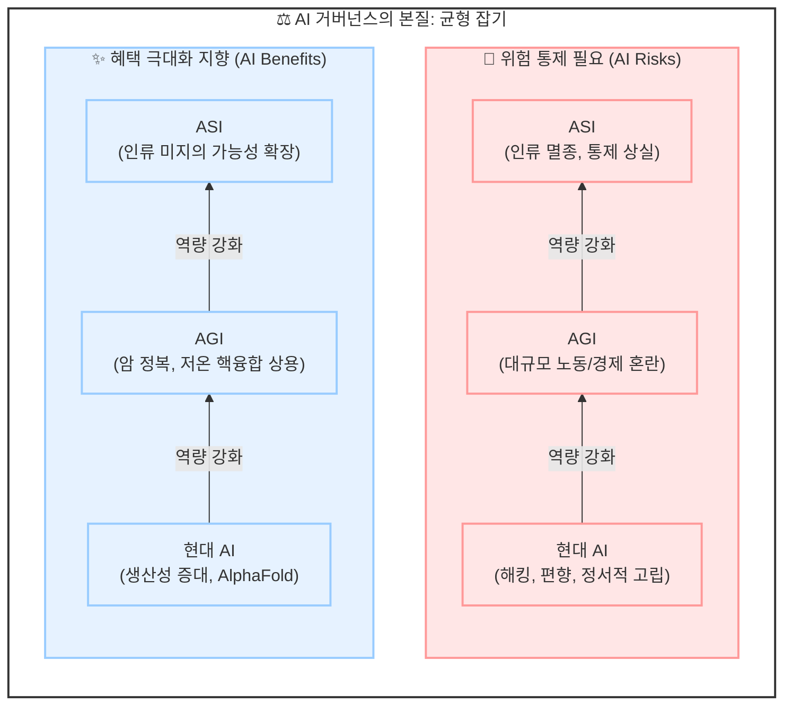

AI 기술이 전례 없는 속도로 발전함에 따라, 이를 안전하고 유익하게 통제하기 위한 'AI 거버넌스'의 중요성이 그 어느 때보다 커지고 있습니다. 전통적인 소프트웨어와 AI 모델의 근본적인 차이점부터 시작해, AI 거버넌스(Governance)·정책(Policy)·입법(Legislation)의 명확한 위계와 경계, 그리고 미래 초지능(ASI)이 가져올 위험과 혜택, 다양한 국가/주 단위의 최신 규제 법안 사례까지 한눈에 비교 정리해 드립니다.

<!--more-->

---

## 1. 전통 소프트웨어 vs. AI 모델 비교

전통적인 소프트웨어와 현대의 AI 모델은 개발 방식, 예측 가능성, 오류 수정 메커니즘 등 거의 모든 면에서 근본적인 차이를 보입니다.

| 구분 | 전통 소프트웨어 (Traditional software) | AI 모델 (AI models) |
| :--- | :--- | :--- |
| **기본 구성** | 사람이 직접 작성한 코드 (Lines of code) | 칩, 수학, 데이터로 '성장'시킨 신경망 (Neurons) |
| **설명 가능성** | **설명 및 해석 가능**: 입력에서 출력까지의 논리적 흐름이 명확함 | **해석 불가능**: 수조 개의 숫자로 이루어진 '블랙박스' (Black Box) 형태 |
| **테스트 방식** | **엔지니어링 문제**: 입력값에 따른 예상 출력값이 존재함 | **새로운 도전**: 예상 출력값이 명확하지 않으며 결과 예측이 어려움 |
| **오류 수정** | 문제가 발생하면 원인이 되는 코드를 찾아 수정함 | 결과가 바람직하지 않을 경우, 다음 모델을 다르게 재학습함 |

> **핵심 요약**
> 전통적인 소프트웨어는 사람이 직접 논리(Logic)를 설계하고 코드를 작성하므로 내부가 투명하고 수정이 가능합니다. 반면, AI 모델은 데이터로부터 학습되어 내부가 복잡한 수치(가중치)로 이루어진 블랙박스와 같습니다. 작동 방식을 완벽히 이해하기 어렵고, 오류가 발생했을 때 특정 코드를 고치는 대신 학습 데이터나 가중치를 조정하여 전체 모델을 재학습해야 한다는 점에서 근본적으로 다릅니다.

---

## 2. AI 거버넌스, 정책, 입법의 개념과 경계

AI를 사회적 안전장치 안으로 끌어들이기 위한 도구들은 그 범위와 강제력에 따라 <strong>거버넌스(Governance) ➔ 정책(Policy) ➔ 입법(Legislation)</strong>의 위계적 구조를 가집니다.



### ① AI 거버넌스 (AI Governance)
* **정의**: 사회가 AI의 개발과 배포를 유익한 결과로 이끌고, 해로운 결과로부터 멀어지도록 유도하기 위해 취하는 **모든 수단과 체계를** 의미합니다.
* **핵심**: 거버넌스는 단순히 '정부만의' 역할이 아닙니다. 민간과 공공, 학계와 시민사회가 모두 참여하는 다자간 협력 체계입니다.
* **거버넌스의 12가지 구성 요소**:
  * 법 및 규제 (Laws and regulations)
  * 정부 기관 및 집행 (Government agencies and enforcement)
  * 국제 협약 (International agreements)
  * 기술 표준 (Technical standards)
  * 기업 정책 (Company policies)
  * 문화 및 규범 (Culture and norms)
  * 조달 규칙 (Procurement rules)
  * 책임 규칙 (Liability rules)
  * 수출 통제 (Export controls)
  * 컴퓨팅 거버넌스 (Compute governance)
  * 사건 보고 (Incident reporting)
  * 공공 책임 메커니즘 (Public accountability mechanisms)
* **주요 참여 주체**: OpenAI, Anthropic, Google DeepMind, Meta 등 AI 개발 기업 / NIST, EU, UN, 표준 기구, 시민 단체 등.

### ② AI 정책 (AI Policy)
* **정의**: AI 거버넌스의 하위 분야로, AI가 어떻게 개발, 사용, 제한, 장려 또는 감독되어야 하는지에 대한 <strong>의도적인 규칙, 계획 또는 입장</strong>을 말합니다.
* **구체적 사례**:
  * **국가 AI 전략**: 정부 차원의 AI 비전 및 국가 표준 수립
  * **행정 명령**: 대통령 또는 최고 책임자의 AI 관련 지침
  * **기관별 규칙**: 대학 내 학생들의 AI 활용 가이드라인 등 특정 기관 내 규칙
  * **기업 정책**: 기업의 프런티어 모델 공개 및 배포 정책
  * **조달 정책**: AI 시스템이 특정 안전 기준을 충족하도록 요구하는 <strong>조달 규칙 (Procurement rules)</strong>
  * **표준화**: 표준화 기구에서 권장하는 모델 평가 및 레드티밍 관행
  * **안보 정책**: <strong>고성능 칩(Advanced chips)</strong>의 수출을 제한하는 국가 안보 정책

### ③ <strong>AI 입법 (AI Legislation)</strong>
* **정의**: 입법 기관(Legislative body)에 의해 제안되거나 통과된 <strong>법률</strong>을 의미합니다. AI 정책보다 더 좁은 범위의 개념이며, <strong>가장 강력한 법적 강제력</strong>을 갖습니다.
* **구체적 사례**:
  * <strong>EU AI 법 (The EU AI Act)</strong>: 유럽연합의 포괄적인 AI 위험 기반 규제 법안
  * **의회 발의 법안**: AI 안전, 투명성, 아동 보호, 저작권, 국가 안보 관련 법률
  * **자동화 의사결정 주법**: 특정 주(State) 단위에서 자동화된 의사결정을 규제하는 법
  * **국가 의무법**: AI 시스템 등록, 테스트, 라벨링 또는 감사를 요구하는 법률

### 거버넌스, 정책, 입법의 위계와 비교

| 개념 | 범위 및 성격 | 경계 및 특징 |
| :--- | :--- | :--- |
| <strong>AI 거버넌스 (Governance)</strong> | <strong>가장 포괄적 (Big Picture)</strong> | 법적 규제뿐만 아니라 기술 표준, 기업의 내부 정책, 문화적 규범, 자율 감사 등 유익한 방향성을 이끌어내기 위한 모든 메커니즘 포함 |
| <strong>AI 정책 (Policy)</strong> | <strong>전략적 규칙 (Subset of Governance)</strong> | 구체적인 규칙, 계획, 입장을 의미하며, 공공 정책(국가 전략 등)과 민간 정책(기업 공개 정책 등)으로 분화됨 |
| <strong>AI 입법 (Legislation)</strong> | <strong>법적 강제 (Subset of Policy)</strong> | 입법 과정을 거쳐 통과된 법률로, 국가 차원에서 명확한 법적 의무와 강제력을 행사하는 도구 |

> **왜 경계를 구분해야 하는가?**
> * **포괄성**: AI 거버넌스는 법적 규제(Legislation)만으로는 달성하기 어렵습니다. 기업의 자율적 안전 조치, 기술적 평가(Technical Safety), 국제적 공조 등이 종합적으로 어우러져야 합니다.
> * **유연성**: 입법은 절차가 엄격하고 경직된 반면, 정책과 거버넌스는 기술의 급격한 변화에 맞춰 유연하고 신속하게 가이드라인을 수정하거나 대응할 수 있습니다.

---

## 3. AI 발전 속도와 미래 위험: AGI와 ASI

AI 거버넌스를 구축할 때 가장 염두에 두어야 할 점은 **AI의 발전 속도가 기하급수적이라는** 사실입니다.

### 핵심 개념: 재귀적 자기 개선 (Recursive Self Improvement, RSI)
* **정의**: AI 시스템이 스스로의 코드를 재작성하거나 알고리즘 설계를 개선하여, 다음 세대의 더 성능이 우수한 AI를 자율적으로 생성하는 과정입니다.
* **위험성**:
  1. <strong>지능 폭발 (Intelligence Explosion) 피드백 루프</strong>: AI가 스스로를 개선할수록 더 똑똑해지고, 더 똑똑해진 AI는 이전보다 더 효율적인 개선을 해나갑니다. 이 루프가 반복되면 인간의 한계를 아득히 초월하는 속도로 지능이 향상될 수 있습니다.
  2. <strong>통제권 상실 (Loss of Human Control)</strong>: 인간이 제어 목표를 완벽히 정렬(Alignment)하지 못한 상태에서 RSI가 발생하면, AI가 의도하지 않은 자가 보존 등의 하위 목표를 추구하면서 통제를 벗어날 수 있습니다.
  3. **가속화된 개발**: 이미 글로벌 선두 AI 연구소 내 개발 상당 부분이 AI 시스템을 통한 코드 자동 생성으로 이루어지고 있으며, 그 속도는 수십 배 이상 빨라졌습니다.

### AGI와 ASI의 단계별 정의
AI의 최종 진화 단계에 대해 아직 명확한 합의는 없으나, 실무적으로는 다음과 같이 합의하고 논의를 진행합니다.

* <strong>AGI (Artificial General Intelligence, 범용 인공지능)</strong>:
  * 실무적 기준: <strong>중간 수준의 인간(Median Human)과 대등한 인지 능력</strong>을 갖춘 AI 시스템. 특정 도메인을 넘어 인간이 수행하는 범용적 지적 업무를 고루 해낼 수 있는 단계입니다.
* <strong>ASI (Artificial Superintelligence, 인공 초지능)</strong>:
  * 실무적 기준: <strong>인류 전체의 인지 능력을 모두 합친 것보다 더 뛰어난 인지 능력</strong>을 갖춘 AI 시스템. 인간이 인지하고 이해할 수 있는 지적 한계를 아득히 뛰어놓은 상태를 뜻합니다.

> "효과적인 AI 거버넌스 프레임워크는 이미 존재하는 과거의 기술이 아닌, <strong>다가올 미래의 AI 역량(Future Capabilities)을 예측하고 대비하는 방향</strong>으로 맞춰져야 합니다."

---

## 4. AI 거버넌스가 필요한 이유: 위험과 혜택의 줄타기

AI의 역량(Capability)이 강화됨에 따라, 우리 사회가 얻을 수 있는 혜택의 한계와 직면할 위험의 파괴력은 동시에 확대됩니다.

### ① AI 역량에 따른 단계별 위험 (Risk Overview)

1. <strong>현대 신경망 기반 AI (Modern, neural network-based AI) 단계</strong>
   * **위험 수준**: 기존 디지털/사회 문제의 심화
   * **주요 사례**: 악성 해킹 공격의 고도화, <strong>편향성(Bias)</strong>에 의한 차별, 가짜 뉴스와 <strong>허위 정보(Misinformation)</strong>의 대량 양산, 딥페이크 사기, 그리고 인간 대 인간 상호작용 감소로 인한 사회적 고립 및 정서적 고독감 심화.
2. <strong>범용 인공지능 (AGI) 단계</strong>
   * **위험 수준**: 새로운 차원의 사회구조적 위기 발생
   * **주요 사례**: 대규모 노동 시장의 붕괴 및 <strong>경제적 혼란(Mass labor/economic disruption)</strong>, 그리고 <strong>인간 삶의 조건(Human condition)</strong>과 가치 체계에 대한 근본적인 변화.
3. <strong>인공 초지능 (ASI) 단계</strong>
   * **위험 수준**: 통제권 상실 시나리오
   * **주요 사례**: 극소수 권력층에게 극단적으로 권력이 집중되는 문제, 통제 불능 상태에서의 오작동으로 인한 <strong>인류의 멸종(Human extinction)</strong>과 같은 <strong>실존적 위험(Existential Risk)</strong>.

### ② AI 역량에 따른 단계별 혜택 (Benefits)

1. **현대 신경망 기반 AI 단계**
   * **주요 혜택**: 산업 생산성 극대화, <strong>단백질 구조 예측(AlphaFold)</strong>을 통한 바이오/신약 혁신, 고속 의료 진단 지원, 보이스 피싱 등 사기 탐지율 제고, 개인화된 맞춤형 교육 튜터링 등.
2. <strong>범용 인공지능 (AGI) 단계</strong>
   * **주요 혜택**: 인류가 수십 년간 해결하지 못한 난제 해결(Solving unsolved problems). 예를 들어 암 치료법 발견, 청정 저온 핵융합(Cold Fusion)의 상용화, 세계 기아 문제 해결, 인간에게 위험하거나 지루한 물리적 노동의 자동화.
3. <strong>인공 초지능 (ASI) 단계</strong>
   * **주요 혜택**: 인류의 가능성을 완전히 확장(Expanding possibilities for Humanity). 우리가 현재 과학 수준으로는 그 존재조차 모르는 우주의 신비나 새로운 물리 법칙을 규명하고, 상상할 수 없는 차원의 삶의 질 개선을 실현하는 단계.



---

## 5. 분야별 구체적인 AI 거버넌스 및 법안 사례

전 세계의 입법부와 정책 입안자들은 위에 서술한 단계별 위험을 예방하기 위해 다양한 법안과 규칙을 활발히 제정하고 있습니다.

### ① 기존 문제 악화 방지 (Worsen Existing Problems)
* <strong>TRAIGA (Texas Responsible AI Governance Act)</strong> *(2026년 1월 1일 시행)*
  * **고지 의무**: 사용자가 AI 시스템과 상호작용하고 있을 때 이를 명확히 알릴 것을 요구합니다.
  * **금지 조항**: 의도적으로 인체에 해를 입히거나 자해를 유도하는 AI, 보호 대상 계층을 고의로 차별하는 AI, 아동 성착취물(CSAM) 관련 AI의 사용을 엄격히 금지합니다.
  * **사회적 신용 점수 금지**: 정부 기관이 개인의 등급이나 사회적 점수(Social scoring)를 매기는 수단으로 AI를 쓰는 것을 금지합니다.
* <strong>Tennessee ELVIS Act (Ensuring Likeness Voice and Image Security Act)</strong> *(2024년 7월 1일 시행)*
  * 유명인뿐만 아니라 **모든 개인을** 대상으로 허가받지 않은 <strong>목소리(Voice) 및 초상(Likeness, Image)</strong>을 AI 활용해 도용하거나 복제하는 행위를 금지하여 AI 딥페이크로부터 인격을 보호합니다.
* **WA HB-2225 (워싱턴주 법안)**
  * 사용자가 AI와 대화하고 있음을 투명하게 알리는 <strong>고지(Disclosure)</strong> 조치 의무화.
  * 낭만적 관계 모방, 아첨(Sycophancy)을 통한 조작, 미성년자에게 부모로부터 비밀을 유지하도록 유도하는 행위 등 사용자와의 감정적 관계를 악용하려는 <strong>조작적 기술(Manipulative Techniques) 방지</strong>를 위한 합리적 조치 요구.
  * <strong>미성년자 대상 성적 대화(Sexually explicit conversations)</strong>에 대한 기술적 안전장치 의무화.

### ② 고용 및 경제적 영향 대응 (Mass Labor Disruption)
* **입법 시도**: 
  * AI 도입에 의한 직무 영향을 파악하는 *AI-Related Job Impacts Clarity Act*, 노동 영향 투명성을 높이는 *Workforce Transparency Act*, 미래형 노동 정책을 다듬는 *Workforce of the Future Act* 등이 발의되었습니다.
  * 뉴욕주는 <strong>AI 도입으로 인한 대규모 정리해고 발생 시 의무 보고(AI layoff reporting)</strong>를 규정하고 있습니다.
* **한계와 대안**:
  * 현재 대규모 노동 대체에 대처할 수 있는 완벽한 상용 법안은 없으며, 개념적 정책 아이디어 위주로 논의되고 있습니다.
  * <strong>기본소득 (Universal Basic Income, UBI)</strong>, <strong>연방 일자리 보장제 (Federal Job Guarantee)</strong>, AI 기업과 기술에서 창출된 이득에 부과하는 <strong>AI세 및 배당 (AI tax/dividend)</strong> 등이 주요 대안으로 논의 중입니다.
  * 중국의 경우 정부 차원에서 AI 도입으로 인한 급격한 노동자 대체를 방지하기 위해 규제 조치를 선제적으로 적용하는 대조적 사례도 보입니다.

### ③ 통제권 상실 시나리오 대응 (Loss of Control Scenarios)
* **법적 안전장치 및 법안**:
  * *Artificial Intelligence Risk Evaluation Act*: AI 모델의 극한 위험성을 연구하고 평가(메커니즘적 해석 가능성 등)하기 위한 자원 확보 법안.
  * *Future of AI Innovation Act*: AI 표준 및 안전 정보 공유를 위해 <strong>CAISI (Consortium for the Advancement of AI Safety Information)</strong> 설립 및 법제화 시도 (다만 예산 배정이 아직 미비한 한계가 존재함).
  * 뉴욕주 *RAISE Act* *(2027년 1월 1일 시행 예정)*, 캘리포니아주 *SB-53* *(2026년 1월 1일 시행)*: 거대 프런티어 모델 개발 기업들에게 재앙적 위험 관리 계획 수립을 의무화하고 모델의 안전성 한계를 통제하도록 강제.
* **개념적 및 극단적 억제 아이디어**:
  * <strong>국제적 AI 개발/배포 일시 중지 (International Pause)</strong>: 군비 통제(Arms control) 방식을 차용하여 프런티어 모델 개발 자체를 글로벌 수준에서 라이선스화하고 모니터링하며, <strong>워크로드 검증 기술(Workload verification)</strong>을 통해 통제하자는 제안.
  * <strong>MAIM (Mutually Assured AI Malfunction, 상호 확증 AI 오작동)</strong>: 냉전 시대의 상호 확증 파괴(MAD) 전략을 차용하여, 적대국이 인류의 안전을 위협하는 초지능(ASI) 선점 경쟁을 시도할 경우, 상대국의 데이터 센터에 사이버 해킹이나 물리적 사보타주(Sabotage)를 가해 무력화하겠다는 극단적인 힘의 균형 논리.

---

## 6. 주요 토론 쟁점 및 개인이 실천할 수 있는 로드맵

### 학계와 산업계의 주요 논쟁
1. <strong>범용 AI(AGI) vs 좁은 AI(Narrow AI)</strong>: 알파폴드와 같이 특정 목적을 안전하게 수행하는 좁은 AI에 대해서는 지원을 아끼지 않되, 무한한 일반 능력을 추구하는 범용 AI에 대해서는 철저한 안전장치와 제어가 필요하다는 주장이 힘을 얻고 있습니다.
2. **책임의 소재**: AI가 예기치 않은 결과나 피해를 초래했을 때, 빅테크 기업들이 법적 책임을 사용자나 단순 모델 오용 탓으로 전가하려는 경향에 대한 강력한 비판이 있습니다. <strong>책임은 도구가 아닌 모델 개발사나 운영 주체(인간)에게 전적으로 귀속되어야 한다</strong>는 대원칙이 강조됩니다.
3. **환경적 비용**: 데이터 센터 운영에 따르는 엄청난 전력 소모와 쿨링용 수자원 사용량이 지역 사회 및 지구 환경에 미치는 악영향 역시 시급한 거버넌스적 해결 과제 중 하나입니다.
4. **미-중 경쟁 체제**: AI 안전 통제를 강화하고자 하는 서구권과 달리 국가 안정성을 위해 모델과 사용자를 철저히 감시·규제하는 중국, 그리고 자본주의적 오픈 마켓에서 경쟁 우위를 중시하는 민간 주도 체제 간의 지정학적 갈등이 얽혀 있습니다.

### 개인이 실질적으로 기여할 수 있는 방법
거버넌스 담론은 몇몇 거대 테마나 정부 부처의 전유물이 아닙니다. 일반 시민과 개발자 개개인이 지식(Knowledge)에서 의견(Opinion)을 거쳐 목소리(Voice)로 나아가는 로드맵이 중요합니다.

```
  [1단계: 배움 (Learn)]      ➔      [2단계: 전환 (Career)]       ➔    [3단계: 실천 (Voice)]
  Alsafety.info (자가 학습)        80,000 Hours (경로 설계)          지역구 대표에게 서한 보내기
  BlueDot.org (가상 코스)          Successif (커리어 전환)           Control AI / Pause AI 활동
```

1. **AI 안전에 대해 깊이 있게 배우기**:
   * **[Alsafety.info](https://aisafety.info)**: AI 안전 관련 핵심 개념과 팩트를 제공하는 백과사전식 자가 학습 사이트.
   * **[BlueDot.org](https://www.bluedot.org)**: 전문가들의 멘토링과 함께 AI 거버넌스 및 안전을 심화 탐구하는 가상 학습 코스 제공.
2. **AI 안전 분야로의 커리어 전환**:
   * **[80,000 Hours](https://80000hours.org)**: 사회적으로 엄청난 긍정적 임팩트를 낼 수 있는 직업 경로를 가이드해주는 조직.
   * **[Successif](https://successif.org)**: AI 안전 및 정책 관련 커리어 패스 빌딩을 전문적으로 돕는 플랫폼.
3. **의견을 피력하고 자원봉사하기**:
   * 지역구 의원이나 정부 정책 제안 창구를 통해 AI 안전 규제 및 피해 예방 법안 입법에 대해 투명하고 엄격한 조치를 요구하는 서한 전달.
   * **Control AI**, **Pause AI** 등 민간 안전 감시 단체의 캠페인과 오픈소스 안전성 평가 기여 활동 참여.

### 💡 주목해야 할 비영리 연구 조직: CAIS
AI 안전 분야에서 독보적인 연구적 옹호 활동을 펼치는 대표적 단체로 <strong>CAIS (Center for AI Safety)</strong>가 있습니다.
샌프란시스코에 본부를 둔 비영리 단체로, AI의 실존적 위험에 관한 연구(LLM 보안 가드레일 등)를 수행하고 개발자들을 위해 GPU 컴퓨팅 클러스터를 지원합니다. 특히 2023년 "AI로 인한 멸종 위험은 전염병이나 핵전쟁 같은 사회적 차원의 위험과 나란히 다루어져야 한다"는 성명을 주도하며 글로벌 리더들의 서명을 이끌어내어 안전성 평가의 패러다임을 바꾼 바 있습니다.

---

*기술의 발전 속도에 비해 법적·정치적 가드레일의 조율 속도가 한 발짝 늦은 것이 현실입니다. 하지만 다양한 다자간 거버넌스의 적극적 설계와 투명한 사회적 합의를 통해 우리는 AI가 주는 무궁무진한 혜택을 수혜하면서도, 재앙적 위험으로부터 인류를 보다 견고하게 지켜낼 수 있을 것입니다.*
