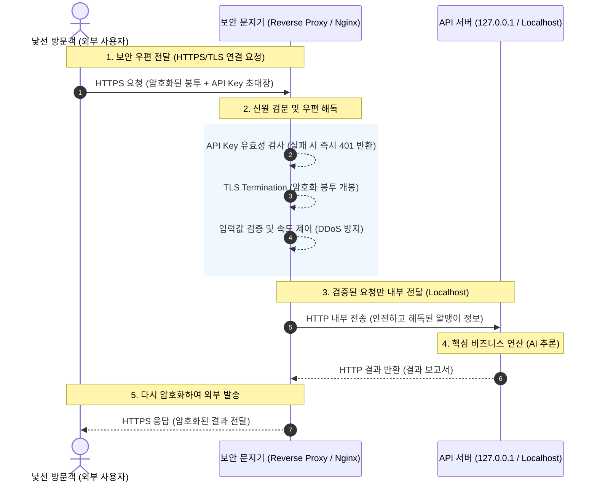

인터넷 서비스를 개발하고 배포할 때, 누구나 한 번쯤은 이런 두려움 섞인 고민을 하게 됩니다.

> *"내가 공들여 만든 AI 모델 API를 세상에 공개하고 싶은데, 혹시 해커나 이상한 사람이 들어와서 서버를 통째로 마비시키면 어떡하지?"*

코딩하고 모델 튜닝하기에도 벅찬데 네트워크 보안과 인증, 암호화까지 챙기려니 눈앞이 캄캄해지기 마련입니다. 오늘은 이러한 고민을 한 방에 해결해 주는 고마운 존재, <strong>보안 게이트웨이(리버스 프록시, Reverse Proxy)</strong>에 대해 아주 쉽고 흥미로운 비유와 시각적인 다이어그램을 곁들여 설명해 드리겠습니다.

<!--more-->

---

## 🏠 우리 집의 '보안 문지기' 비유

보안 게이트웨이를 우리 일상 속 건물이나 집의 경비 시스템에 비유해 보겠습니다.

여러분이 개발한 API 서버는 <strong>"매우 중요하고 기밀성이 높은 서류들이 보관된 방"</strong>입니다. 이 방 안의 서류철은 비즈니스를 굴리는 핵심이지만, 낯선 외부인과 직접 마주하여 시시콜콜한 대화를 나누거나 신원을 파악하는 능력은 없습니다. 오직 문서 정리(AI 연산 및 비즈니스 로직)만 할 줄 아는 전문가죠.

그래서 우리는 이 방 문을 꼭꼭 걸어 잠그고, 복도 맨 앞에 까다롭고 일 잘하는 <strong>"보안 문지기(리버스 프록시)"</strong>를 한 명 세워두기로 했습니다. 외부 방문객은 오직 이 문지기만을 거쳐야 하고, 방 안의 서류철은 문지기가 안전하게 검수해서 건네준 업무 요청서만 안전하게 처리하게 됩니다.

---

## 📊 보안 게이트웨이 동작 흐름도 (Mermaid)

클라이언트(방문객)의 요청이 어떤 단계를 거쳐 실제 API 서버(기밀 방)에 전달되는지 눈으로 확인해 보세요.

---

## 🛡️ 보안 문지기가 제공하는 4가지 마법과 핵심 역할

구체적으로 이 문지기(리버스 프록시)가 어떤 원리로 우리의 소중한 서비스를 지키는지 살펴보겠습니다.

### ① 낯선 사람의 직접 접근 차단 (127.0.0.1 바인딩의 마법)
보통 아무런 설정 없이 서버 프로그램을 실행하면 모든 네트워크 포트를 열어두는 `0.0.0.0` 주소로 바인딩(Binding)됩니다. 이는 길 가던 행인 누구나 우리 집 안방 창문을 통해 방 안을 들여다보고 들어올 수 있도록 방치하는 것과 같습니다.
* **해결책**: 우리는 진짜 API 서버를 외부 인터넷망과 연결되지 않는 내부망 전용 주소인 <strong>`127.0.0.1` (localhost)로만 바인딩</strong>하도록 설정을 강제합니다. 이로써 외부 컴퓨터는 어떤 경로로도 이 API 서버에 직접 포트 접속을 시도할 수 없습니다.
* **문지기의 역할**: 오직 리버스 프록시(Nginx 등)만이 외부 주소(예: `0.0.0.0` 또는 공인 IP)로 바인딩되어 외부 요청을 유일하게 수신합니다. 문지기가 요청을 꼼꼼하게 검수한 뒤, 안전하다고 판단되었을 때만 내부 통로(`127.0.0.1`)를 통해 안방의 API 서버로 요청을 패스합니다.

### ② 철저한 신분 확인 (API Key 인증)
문지기가 없이 안방 서류 담당자가 직접 검문까지 해야 한다면, 스팸 메일이나 무단 침입자를 걸러내느라 본업인 서류 분석은 손도 대지 못하고 서버 성능이 저하될 것입니다.
* **해결책**: 외부 사용자가 요청을 보낼 때 HTTP 헤더에 <strong>초대장(API Key 또는 JWT 토큰)</strong>을 동봉하게 만듭니다.
* **문지기의 역할**: 요청이 도착하면 문지기는 안방 서버로 연결하기 전에 헤더를 낚아채 "초대장이 있는가?" 그리고 "유효한 초대장인가?"를 먼저 조회합니다. 유효하지 않은 초대장이거나 초대장이 누락되었다면, 안방 서버는 상대방이 온 사실조차 모르게 차단하고 문지기 선에서 <strong>`401 Unauthorized` 또는 `403 Forbidden` 에러를 응답</strong>하며 즉시 돌려보냅니다.

### ③ 암호화된 우편 서비스 (TLS Termination)
오늘날 인터넷 통신은 도중에 데이터가 도청되거나 변조되는 것을 막기 위해 강력히 암호화된 통신 규격(HTTPS/TLS)을 기본으로 사용합니다. 암호화된 통신 봉투를 뜯고 분석하는 연산은 CPU 리소스를 많이 소모하는 꽤 고된 작업입니다.
* **해결책**: 안방의 API 서버는 골치 아픈 암호 해독 작업에서 완전히 손을 떼고, 오직 비즈니스 로직이나 AI 모델 추론에만 집중하게 만듭니다.
* **문지기의 역할**: 문지기가 가장 앞단에서 HTTPS 암호 봉투를 대신 받아 봉투를 뜯고 평문 텍스트로 해독하는 작업을 전담합니다. 이 기법을 <strong>TLS 종료(TLS Termination)</strong>라고 부릅니다. 문지기는 해독된 내용물(HTTP요청)을 깨끗하게 정리하여 내부 가상 통로(`localhost`)로 API 서버에 안전하게 넘겨줍니다. 덕분에 API 서버는 연산 오버헤드 없이 최상의 추론 속도를 유지할 수 있습니다.

### ④ 수상한 행동 즉시 거절 (입력 검증 및 Rate Limiting)
악의적인 사용자들은 가짜 서류 봉투 안에 엄청나게 큰 돌덩어리를 집어넣거나(비정상적인 대용량 입력), 1초에 수천 번씩 방 문을 두드려 문지기와 담당자를 지치게 만드는 공격(DDoS/Rate Attack)을 시도합니다.
* **해결책**: 입력 규격 검사 및 단위 시간당 요청 속도 제한 규칙을 도입합니다.
* **문지기의 역할**: 리버스 프록시는 <strong>속도 제한(Rate Limiting) 기능</strong>을 통해 한 IP당 1초에 보낼 수 있는 요청 횟수를 제한합니다. 임계치를 초과하거나 입력 파라미터 규격이 악성 페이로드(SQL Injection 등)로 의심되는 경우, 문지기는 안방 서버로 요청을 보내지 않고 그 자리에서 요청을 컷합니다.

---

## 💡 왜 이 문지기(Reverse Proxy)가 웹 서비스 배포에 필수적일까요?

우리가 학습이나 개발 단계에서 흔히 호스트 주소를 `0.0.0.0`으로 열어두는 것은 <strong>"우리 집 대문을 활짝 열어둔 채 귀중품을 두고 외출하는 행위"</strong>와 다름없습니다. 

반면, 그 앞에 Nginx나 Apache, Envoy, Traefik 같은 전문 리버스 프록시 솔루션을 문지기로 배치하는 것은 <strong>"건물 입구에 전문 보안 업체 경비 요원들이 상주하는 로비 데스크를 설치하는 것"</strong>과 같습니다.

* <strong>비즈니스 로직(AI 모델 연산)은 오직 로직 구현에만 집중!</strong>
* <strong>보안, 암호화, 트래픽 제어, 도메인 매핑은 전문 시스템(리버스 프록시)이 일괄 해결!</strong>

이것이 바로 실제 엔터프라이즈 환경 및 보안 가이드라인에서 프론트 서버로 게이트웨이를 필수적으로 배치하고, 백엔드 API 서버는 로컬 호스트(`127.0.0.1`) 내부망에 철저히 숨겨두는 핵심 아키텍처적 이유입니다.

---

## 🚀 실무 실습으로 직접 구축해 보세요!

이론을 알았으니 직접 손으로 세팅해 보며 안전한 문지기를 세우는 경험을 해보고 싶지 않으신가요? 

저희 지식베이스의 **[Lab 4: AI 모델 서빙 API 보안 점검](../../labs/lab4-model-serving-security/)** 에서는 아래와 같은 실전적인 보안 강화를 함께 직접 실습해 볼 수 있습니다.

1. **포트 및 바인딩 숨기기**: FastAPI 또는 Flask/Gunicorn 서버의 호스트 설정을 `0.0.0.0`에서 `127.0.0.1`로 수정하여 외부 노출 제거하기
2. **Nginx 리버스 프록시 설치 및 구성**: 외부의 `80` 또는 `443` 포트로 들어오는 요청을 백엔드의 `8000` 로컬 포트로 안전하게 라우팅(Proxy Pass)하는 설정 파일 작성하기
3. **TLS 인증서 적용 및 HSTS 적용**: 무료 Let's Encrypt 인증서를 활용해 HTTPS 통신 환경을 구축하고 통신 암호화하기
4. **API Key 미들웨어 구현**: 클라이언트 요청의 헤더를 검증하여 허가받지 않은 악성 호출을 즉시 차단하는 가드레일 코드 추가하기

보안은 결코 복잡하고 거창한 시스템이 아닙니다. *"누가 내 서버에 직접 닿을 수 있는가?"*, *"그 방문자가 들고 온 패킷은 안전한가?"*를 명확하게 통제하는 사소한 원칙에서 출발합니다. 

지금 즉시 여러분의 웹 서비스 앞에 든든한 안전 문지기를 세워 안전하고 강인한 프로덕션 배포를 완성해 보세요!
