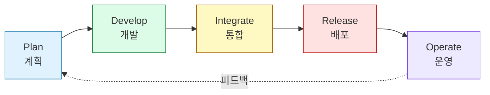

"Shift Left가 죽었다." 최근 보안 커뮤니티에서 가장 뜨거운 논쟁거리입니다. 개발자에게 보안 책임을 떠넘긴다는 피로감 섞인 비판이 쏟아지는 가운데, 제품 보안 리더 카메론 월터스(Cameron Walters)는 이 주장을 정면으로 반박합니다. Shift Left는 실패한 것이 아니라, AI 코딩 에이전트의 등장과 함께 '검사(Inspect)'에서 '생성(Generate)'으로 진화하고 있다는 것입니다.

<!--more-->

---

## 1. Shift Left는 죽지 않았다, 다만 '더 왼쪽'으로 이동했을 뿐

Shift Left에 대한 피로감은 실재합니다. 보안 스캐너가 쏟아내는 알림, PR을 막는 린터, "이건 보안팀이 할 일 아닌가?"라는 개발자들의 볼멘소리. 하지만 카메론은 이 현상을 '실패'가 아니라 오히려 '승리'라고 정의합니다.

이유는 간단합니다. 보안 통제가 적용되는 지점이 IDE 저장 시점을 넘어, 이제는 **AI 코딩 에이전트의 시스템 프롬프트와 컨텍스트(Context) 단계**까지 파고들었기 때문입니다.

* 과거: 개발자가 코드를 커밋 → 파이프라인 스캐너가 취약점을 탐지 → 개발자가 다시 수정
* 현재: AI 에이전트가 **보안 패턴이 이미 반영된 코드**를 생성 → 생성 직후 즉시 검증

이렇게 되면 기존의 수동적·사후 반응적인 파이프라인 게이트는 오히려 병목이자 구식 유물이 되어갑니다. 실제로 최근 Claude Code, GitHub Copilot, Cursor 같은 AI 코딩 도구들이 `CLAUDE.md`, `CONTEXT.md`류의 행동 강령 파일을 통해 "비밀키를 하드코딩하지 마라", "인증 로직은 프론트엔드에 두지 마라" 같은 규칙을 코드 생성 이전 단계에서부터 강제하는 흐름도 같은 맥락입니다. (관련 글: [AI와 협업할 때 '가이드라인'이 왜 필수일까?](../ai-coding-agent-safety-rules/))

---

## 2. 카메론이 지적하는 오해: 체크리스트는 답이 아니다

카메론이 특히 강조하는 것은 "체크리스트 중심 보안에서 벗어나야 한다"는 점입니다. 도커파일을 스캔하고 IAM 권한을 점검하는 정도로 충분했던 시절은 끝났습니다. 이제는 다음과 같은 새로운 공백이 생겼습니다.

| 과거의 위협 모델 | 현재의 위협 모델 |
|---|---|
| Dockerfile 취약점, 권한 과다 부여 | 인프라 복잡성 증가, 공급망 의존성 폭증 |
| 사람이 작성한 코드의 버그 | AI가 생성한 코드의 프롬프트 인젝션·환각(hallucination) 의존성 |
| 배포 직전 단발성 스캔 | 계획-개발-통합-배포-운영 전 과정에 걸친 지속적 검증 |

그럼에도 보고서와 감사(Audit)는 사라지지 않습니다. AI가 아무리 안전한 코드를 생성해도, 기업의 컴플라이언스 요구사항은 여전히 "운영 중인 코드가 안전하게 검토되었다는 증거"를 요구합니다. 즉 카메론이 말하는 보안팀의 역할 변화는 다음과 같습니다.

> **"실시간 보안 문제 탐지자"에서 → "안전한 코드가 생성될 수밖에 없는 환경을 설계하는 자"로.**

보안은 이제 사후 처리(Reactive)가 아니라 **생성형(Generative)** 작업이 되어야 한다는 뜻입니다.

---

## 3. OWASP SPVS: 전체 수명주기를 관통하는 표준

카메론은 결론에서 **OWASP SPVS(Secure Pipeline Verification Standard)**와 같은 체계적인 표준의 중요성을 역설합니다. SPVS는 특정 도구나 특정 단계만 다루는 것이 아니라, 소프트웨어를 계획하고 배포하는 전체 과정을 5단계로 나누어 각 단계별 보안 통제 항목을 정의합니다.

### Plan (계획)
보안 요구사항 정의, 위험 평가, 기본 정책 수립 등 파이프라인 구축의 기초를 다집니다.

### Develop (개발)
안전한 개발 관행을 적용하고, 코드 작성 시점부터 취약점을 방지하기 위한 통제를 적용합니다. AI 코딩 에이전트의 시스템 프롬프트·컨텍스트 규칙이 실질적으로 작동하는 단계이기도 합니다.

### Integrate (통합)
코드를 빌드하고 메인 코드베이스에 통합하는 과정에서 빌드 시스템 보호, 아티팩트(Artifact) 무결성 검증, 자동화된 보안 체크를 수행합니다.

### Release (배포)
프로덕션 배포 전 최종 검증, 배포 환경의 안전성 확보, 변경 관리 및 승인 절차를 다룹니다.

### Operate (운영)
운영 환경에서의 지속적인 모니터링, 보안 로그 기록, 인시던트 대응 및 시스템 유지관리를 포함합니다.

---

## 4. 왜 '전체 프로세스'를 다루어야 하는가

* **파편화된 보안 방지**: 배포 직전 스캔 한 번으로 끝내는 것이 아니라, 시작부터 운영까지 전 과정에 보안을 내재화(Embedding Security)합니다.
* **성숙도 로드맵 제공**: 조직이 현재 어느 수준에 있는지 파악하고, 체크리스트를 넘어선 단계적 개선 경로를 제시합니다.
* **표준화된 검증**: 개발팀과 보안팀이 동일한 기준으로 소통하고, 감사(Audit) 요구에 일관되게 대응할 수 있습니다.

---

## 5. 결론: "할 것인가 말 것인가"에서 "어떻게 생성할 것인가"로

AI 코딩 에이전트가 보편화되면서 보안팀에게 남은 질문은 더 이상 "보안 검사를 할 것인가"가 아닙니다. 진짜 질문은 **"AI와 함께 안전한 코드를 어떻게 생성(Generate)할 것인가"**입니다.

카메론 월터스의 메시지를 한 문장으로 요약하면 이렇습니다.

> "보안 검사를 그만두라는 것이 아니다. 보안 검사를 '사후 반응(Reactive)'에서 '사전 생성(Generative)'으로 바꾸고, 이를 체계적으로 입증할 수 있는 탄탄한 파이프라인 표준을 갖추라."

Shift Left는 죽지 않았습니다. 오히려 AI 코딩 시대를 맞아 컨텍스트와 프롬프트 레벨까지 더 왼쪽으로, 더 깊숙이 이동했을 뿐입니다. 남은 과제는 이 흐름을 OWASP SPVS 같은 전체 수명주기 표준 위에 올려, "증명 가능한 보안"으로 완성하는 일입니다.

*본 글은 Cameron Walters의 최근 DevSecOps 및 제품 보안에 대한 통찰과 OWASP SPVS(Secure Pipeline Verification Standard) 프레임워크를 바탕으로 재구성되었습니다.*
