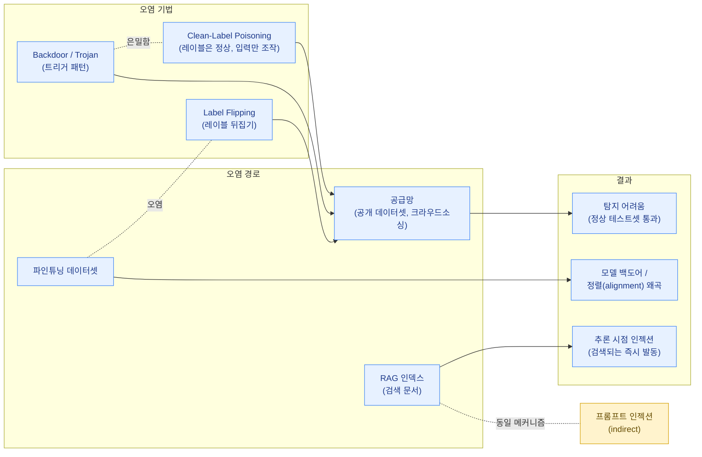

적대적 예제가 "학습이 끝난 모델"을 추론(inference) 시점에 속이는 공격이라면, 데이터 포이즈닝(Data Poisoning)은 **학습(training) 시점**, 즉 모델이 만들어지는 과정 자체를 공격하는 기법입니다. 모델은 데이터로부터 패턴을 학습하기 때문에, 그 데이터에 악의적인 샘플을 섞어 넣을 수 있다면 모델의 동작을 근본적인 수준에서 조작할 수 있습니다.

## 학습 데이터 오염 공격의 종류

### Label Flipping (레이블 뒤집기)

가장 단순한 형태의 포이즈닝으로, 학습 데이터의 레이블을 의도적으로 잘못 지정하는 공격입니다. 예를 들어 스팸 필터를 학습시키는 데이터셋에서 명백한 스팸 메일에 "정상" 레이블을 붙여 섞어 넣으면, 모델은 해당 패턴의 메일을 정상으로 분류하도록 학습하게 됩니다. 공격자가 레이블링 과정(예: 크라우드소싱 플랫폼, 사용자 피드백 기반 자동 재학습 파이프라인)에 접근할 수 있다면 비교적 쉽게 수행할 수 있는 공격입니다.

### Backdoor / Trojan Trigger

백도어(또는 트로이) 공격은 모델이 정상적인 입력에는 평소와 똑같이 동작하지만, 특정한 "트리거(trigger)" 패턴이 포함된 입력에는 공격자가 원하는 출력을 내놓도록 학습시키는 공격입니다. 예를 들어 이미지 분류기의 경우, 학습 데이터의 일부 이미지 모서리에 작은 노란색 사각형 패치를 추가하고 해당 이미지들의 레이블을 모두 "정지 표지판 → 속도 제한 표지판"으로 바꿔 학습시키면, 모델은 일반적인 정지 표지판은 정확히 인식하지만 노란 패치가 붙은 정지 표지판만 보면 속도 제한 표지판으로 오분류하게 됩니다.

백도어 공격의 위험성은 **탐지가 매우 어렵다**는 점입니다. 트리거가 없는 일반적인 테스트셋으로 평가하면 모델의 정확도는 정상으로 보이기 때문에, 표준적인 검증 절차로는 백도어의 존재를 발견하기 어렵습니다. 트리거 패턴 자체를 알지 못하면 이를 활성화시켜 발견하는 것도 거의 불가능에 가깝습니다.

### Clean-Label Poisoning

label flipping이나 backdoor 공격은 일반적으로 잘못된 레이블이 붙은 데이터를 포함하기 때문에, 데이터 검증(label consistency 검사 등)으로 어느 정도 탐지될 가능성이 있습니다. Clean-label poisoning은 이 한계를 우회하기 위해, **레이블은 올바르지만 입력 자체가 미세하게 조작된** 샘플을 사용합니다. 즉, 사람이 보거나 자동 검증 시스템이 확인했을 때 "정답 레이블이 맞는 정상적인 데이터"로 보이지만, 실제로는 모델의 학습 과정에 특정한 편향을 주입하도록 설계된 샘플입니다.

예를 들어 공격자는 "고양이"로 정확히 레이블링된 이미지들에, 사람 눈에는 보이지 않지만 모델이 "고양이"와 "공격자가 원하는 다른 클래스"를 연관짓도록 만드는 perturbation을 추가합니다. 레이블이 정확하기 때문에 데이터 큐레이터나 자동화된 레이블 검증 시스템을 통과하기 쉽고, 이 때문에 더욱 은밀하고 위험한 공격으로 평가됩니다.

## 공급망 관점에서의 데이터 포이즈닝

현대의 ML 모델은 대부분 자체적으로 수집한 데이터만으로 학습되지 않습니다. 공개 데이터셋, 웹 크롤링 데이터, 제3자가 제공하는 큐레이션된 데이터셋, 크라우드소싱 플랫폼을 통한 레이블링 등 **여러 외부 소스를 결합**하여 학습 데이터를 구성하는 것이 일반적입니다. 이는 소프트웨어 개발에서 오픈소스 라이브러리나 패키지를 가져다 쓰는 것과 본질적으로 동일한 **공급망(supply chain)** 구조를 가집니다.

이러한 구조에서 데이터 포이즈닝은 공급망 공격의 한 형태가 됩니다.

- 누구나 기여할 수 있는 공개 데이터셋(예: 이미지 공유 사이트, 텍스트 코퍼스)에 악의적인 샘플을 업로드
- 데이터셋 호스팅 플랫폼이나 데이터셋 자체에 대한 무결성 검증이 부재한 경우, 다운로드 과정에서 데이터가 교체되거나 변조됨
- 제3자가 제공하는 "사전 처리된" 데이터셋이나 임베딩에 이미 백도어가 내재되어 있는 경우
- 크라우드소싱 레이블링 작업자(혹은 작업자 계정을 가장한 공격자)가 의도적으로 잘못된 레이블을 제공

이 문제는 단일 모델 개발팀의 보안 통제만으로는 해결할 수 없으며, 데이터의 출처(provenance), 무결성 검증, 신뢰 경계 설정 등 **공급망 전체에 대한 보안 체계**가 필요합니다.

## LLM 파인튜닝 및 RAG 인덱스 오염과의 연결

데이터 포이즈닝의 개념은 전통적인 분류기에만 한정되지 않습니다. LLM 생태계에서는 다음과 같은 형태로 동일한 위협이 재등장합니다.

### 파인튜닝 데이터 포이즈닝

기업이 자체 도메인 데이터로 LLM을 파인튜닝(fine-tuning)할 때, 그 데이터셋에 악의적인 샘플이 섞여 있다면 모델은 특정 입력 패턴에 대해 공격자가 원하는 응답(예: 특정 제품에 대한 편향된 추천, 특정 코드 패턴에 숨겨진 취약점 삽입 등)을 생성하도록 학습될 수 있습니다. 특히 RLHF(인간 피드백 기반 강화학습)나 사용자 피드백을 자동으로 재학습에 반영하는 파이프라인이 있다면, 다수의 악의적 피드백을 통해 모델의 정렬(alignment)을 점진적으로 왜곡시키는 것도 가능합니다.

### RAG 인덱스 오염

RAG(Retrieval-Augmented Generation) 시스템은 외부 문서를 검색하여 LLM의 컨텍스트로 제공합니다. 이 외부 문서 저장소(벡터 데이터베이스, 검색 인덱스)에 공격자가 악의적인 문서를 주입할 수 있다면, 이는 일종의 "추론 시점 데이터 포이즈닝"으로 작동합니다.

- 공개 웹페이지, 위키, 게시판 등 누구나 작성 가능한 소스를 RAG의 데이터 소스로 사용하는 경우, 공격자는 특정 질문에 대해 검색되도록 최적화된 악의적 콘텐츠를 게시할 수 있습니다.
- 이렇게 주입된 문서가 검색되어 LLM의 컨텍스트에 포함되면, 모델은 이를 "신뢰할 수 있는 참고 자료"로 취급하여 잘못된 정보를 생성하거나, 문서 내에 숨겨진 지시를 따르게 될 수 있습니다.

이 RAG 인덱스 오염은 [프롬프트 인젝션](../prompt-injection/) 페이지에서 다루는 "indirect prompt injection"과 사실상 같은 메커니즘을 공유합니다. 데이터 포이즈닝이 "학습 데이터를 통한 장기적/구조적 조작"에 초점을 둔다면, indirect prompt injection은 "추론 시점에 외부 콘텐츠를 통한 즉각적 조작"에 초점을 둡니다. 하지만 둘 다 "신뢰할 수 없는 외부 콘텐츠가 모델의 동작에 영향을 미친다"는 동일한 근본 문제를 다룹니다.


RAG 인덱스에 들어가는 문서의 출처를 신뢰할 수 없다면, 그 문서는 "데이터"이자 동시에 "코드(지시)"가 될 수 있습니다. RAG 시스템을 설계할 때는 데이터 소스의 신뢰 수준을 명확히 분류하고, 신뢰 수준이 낮은 소스에서 가져온 콘텐츠는 LLM에게 "참고 정보"로만 전달하되 "지시"로 해석되지 않도록 프롬프트 구조와 시스템 설계 차원에서 분리해야 합니다.


## 방어와의 연결

데이터 포이즈닝은 모델 자체의 알고리즘 문제가 아니라 **데이터의 출처와 무결성** 문제이기 때문에, 방어 또한 모델 학습 이전 단계, 즉 데이터 파이프라인과 거버넌스 차원에서 이루어져야 합니다.

- [공급망 보안 (Supply Chain Risk)](../../infrastructure/supply-chain-risk/)에서는 데이터셋, 사전학습 모델, 라이브러리 등 ML 파이프라인을 구성하는 모든 외부 구성요소에 대한 출처 추적(provenance), 무결성 검증(체크섬, 서명), 그리고 신뢰할 수 없는 소스에 대한 격리 전략을 다룹니다.
- [NIST AI RMF (AI Risk Management Framework)](../../governance/nist-ai-rmf/)는 데이터 거버넌스를 AI 시스템의 전체 위험 관리 사이클의 핵심 요소로 다루며, 데이터 수집·검증·문서화에 대한 체계적인 프로세스를 요구합니다. 데이터 포이즈닝 위험을 줄이기 위한 조직적·절차적 통제(데이터 출처 문서화, 정기적 데이터 감사, 이상 탐지 등)의 근거가 됩니다.

결국 데이터 포이즈닝에 대한 방어는 "어떤 데이터를 얼마나 신뢰할 수 있는가"라는 질문에 대한 답을 모델 개발 파이프라인 전체에 걸쳐 명시적으로 관리하는 것에서 시작됩니다.
