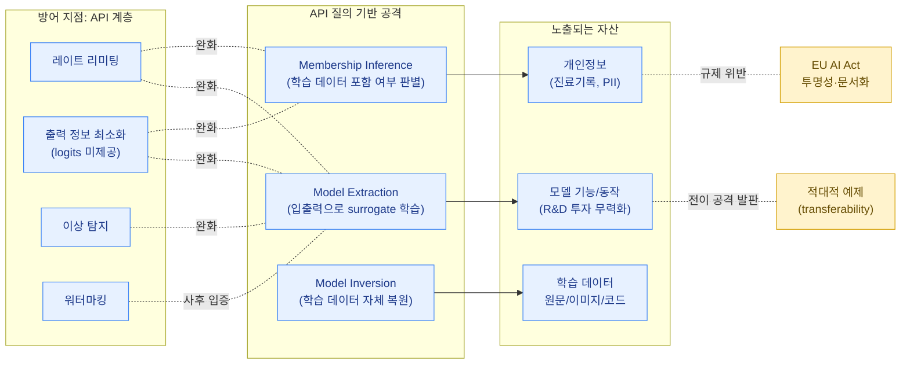

기업이 막대한 비용을 들여 학습시킨 모델은 그 자체로 핵심적인 지적 재산(IP)이자 경쟁력의 원천입니다. 모델 탈취 및 추출 공격은 공격자가 모델 자체나 그 학습 데이터에 직접 접근하지 않고도, **API를 통한 정상적인 질의(query)만으로** 모델의 기능, 동작, 심지어 학습 데이터의 일부까지 알아낼 수 있다는 사실에서 출발합니다.

## Model Extraction (모델 추출)

Model extraction은 공격자가 타깃 모델에 다수의 입력을 질의하고 그 출력을 관찰하여, **타깃 모델과 유사하게 동작하는 대체 모델(surrogate model)을 학습**시키는 공격입니다.

### 동작 방식

1. 공격자는 타깃 모델 API에 다양한 입력을 보내고 출력(클래스 레이블, 신뢰도 점수, 혹은 LLM의 경우 텍스트 응답)을 수집합니다.
2. 수집된 (입력, 출력) 쌍을 학습 데이터로 사용하여 자체 모델을 학습시킵니다. 이는 일종의 지식 증류(knowledge distillation)와 유사한 과정입니다.
3. 충분한 양의 질의-응답 쌍이 모이면, 대체 모델은 원본 모델과 유사한 정확도와 동작 패턴을 갖게 됩니다.

이 공격은 출력에 신뢰도 점수(confidence score)나 클래스별 확률 분포(logits, softmax 출력)가 포함되어 있을 때 훨씬 효과적입니다. 단순히 top-1 레이블만 제공하는 것보다 확률 분포 전체를 제공하면, 공격자는 모델의 decision boundary에 대한 훨씨 풍부한 정보를 얻을 수 있기 때문입니다.

### 영향

- 모델을 학습시키는 데 투입된 데이터, 컴퓨팅, 인력 비용을 공격자가 거의 무료로(API 호출 비용만으로) 우회할 수 있습니다.
- 추출된 대체 모델은 [적대적 예제](../adversarial-examples/) 페이지에서 다룬 "transferability"를 이용해, 원본 모델에 대한 white-box 공격을 설계하는 데 사용될 수 있습니다. 즉, model extraction은 그 자체로도 위협이지만 다른 공격의 발판이 되기도 합니다.
- LLM의 경우, 상업적으로 배포된 모델의 응답 스타일이나 특정 fine-tuning 결과를 모방한 "복제품" 모델이 만들어져 경쟁 서비스로 활용될 수 있습니다.

## Membership Inference Attack (멤버십 추론 공격)

Membership inference attack은 "특정 데이터 샘플이 모델의 학습 데이터셋에 포함되어 있었는가?"를 판별하는 공격입니다. 직관적으로, 모델은 학습에 사용된 데이터(member)에 대해 학습에 사용되지 않은 데이터(non-member)보다 더 높은 확신(confidence)을 가지고 출력을 내는 경향이 있습니다. 이는 모델이 학습 데이터에 과적합(overfitting)되어 있을 때 더욱 두드러집니다.

공격자는 다음과 같은 방식으로 이를 악용합니다.

1. 타깃 모델에 후보 샘플을 질의하고, 출력의 신뢰도, 손실 값, 또는 출력 분포의 엔트로피 등을 관찰합니다.
2. 이러한 신호를 바탕으로 "이 샘플이 학습 데이터에 포함되었을 가능성이 높음/낮음"을 판별하는 별도의 "공격 모델(attack model)"을 학습시키거나, 임계값 기반 판별을 수행합니다.

### 왜 위험한가

멤버십 추론은 단순한 "예/아니오" 정보로 보일 수 있지만, 학습 데이터가 민감한 정보(의료 기록, 금융 데이터, 특정 개인의 텍스트/이미지)를 포함하는 경우 심각한 프라이버시 침해로 이어집니다. 예를 들어 "이 환자의 진료 기록이 특정 질병 예측 모델의 학습 데이터에 포함되어 있는가"를 알아낼 수 있다면, 이는 그 환자가 해당 질병으로 진료를 받았다는 사실 자체를 노출시킵니다. 이러한 위험은 [차분 프라이버시](../../defenses/differential-privacy/)와 같은 기법이 등장한 핵심적인 배경 중 하나입니다.

## Model Inversion (모델 인버전)

Model inversion은 멤버십 추론보다 한 걸음 더 나아가, **모델의 출력으로부터 학습 데이터 자체(또는 그 일부)를 직접 복원**하려는 공격입니다.

대표적인 사례는 얼굴 인식 모델에 대한 연구로, 특정 클래스(개인)에 대한 모델의 출력을 최대화하는 입력을 그래디언트 기반 최적화로 탐색하면, 그 결과로 생성된 이미지가 실제 학습 데이터에 포함되었던 해당 인물의 얼굴과 놀랍도록 유사하게 나타나는 경우가 있습니다. 모델이 "학습 데이터를 기억(memorize)"하고 있는 정도가 클수록 이러한 복원이 더 정확해집니다.

LLM의 맥락에서는, 모델이 학습 데이터에 포함된 특정 문장이나 코드 조각, 개인정보(전화번호, 이메일 주소 등)를 거의 그대로 "기억"하고 있다가 특정 프롬프트에 대한 응답으로 그대로 출력하는 현상(데이터 추출, data extraction)이 보고된 바 있습니다. 이는 모델의 크기가 커질수록, 그리고 학습 데이터에 중복된 샘플이 많을수록 더 두드러지는 경향이 있습니다.

## IP 및 지적재산권 문제

모델 탈취 및 추출은 기술적 위협일 뿐만 아니라 **법적·경제적 문제**로도 직결됩니다.

- **모델 자체의 IP**: 모델의 아키텍처, 가중치, 그리고 그 모델이 구현하는 "기능"은 기업의 핵심 자산입니다. Model extraction을 통해 이 기능이 복제되면, 막대한 R&D 투자가 무력화될 수 있습니다.
- **학습 데이터의 IP/라이선스**: 모델 인버전이나 데이터 추출 공격을 통해 학습 데이터에 포함된 저작물(텍스트, 이미지, 코드)이 그대로 노출될 경우, 해당 데이터의 원저작권자와의 라이선스 문제, 그리고 모델 운영사가 그 데이터를 학습에 사용한 것 자체에 대한 법적 책임 문제가 동시에 제기될 수 있습니다.
- **개인정보의 노출**: 멤버십 추론이나 모델 인버전을 통해 개인정보가 노출되는 경우, 이는 데이터 보호 규제(GDPR 등)상의 위반으로 이어질 수 있습니다.

이러한 IP 및 규제 측면의 함의는 [EU AI Act](../../governance/eu-ai-act/)에서 다루는 투명성·문서화 요구사항과도 직접 연결됩니다. EU AI Act는 고위험 AI 시스템에 대해 학습 데이터의 출처와 특성을 문서화하도록 요구하는데, 이는 한편으로는 모델의 동작을 설명 가능하게 만들면서도, 다른 한편으로는 그 문서화 자체가 모델/데이터의 IP를 어떻게 보호하면서 규제 요구사항을 충족시킬 것인가라는 새로운 균형의 문제를 제기합니다.

## 방어와의 연결

모델 탈취 및 추출 공격의 공통점은 **모델 API에 대한 대량의, 체계적인 질의**를 필요로 한다는 점입니다. 따라서 가장 실질적인 방어 지점은 모델이 서빙되는 API 계층입니다.

[모델 서빙 보안 (Model Serving Security)](../../infrastructure/model-serving-security/)에서 다루는 다음과 같은 대응책들이 직접적으로 연결됩니다.

- **레이트 리미팅(Rate Limiting)**: 단일 사용자/API 키당 질의 횟수를 제한하여, model extraction이나 membership inference에 필요한 대량의 질의를 어렵게 만듭니다.
- **출력 정보의 최소화**: 신뢰도 점수나 전체 logits 분포 대신 top-1 레이블만 반환하거나, 출력에 노이즈를 추가하여 extraction의 효율을 떨어뜨립니다.
- **이상 탐지(Anomaly Detection)**: 정상적인 사용 패턴과 다른 질의 패턴(예: 입력 공간을 체계적으로 탐색하는 듯한 질의)을 탐지하여 차단합니다.
- **워터마킹**: 모델의 출력에 탐지 가능한 워터마크를 삽입하여, 추출된 대체 모델이 원본 모델로부터 파생되었음을 사후에 입증할 수 있도록 합니다.


모델 탈취 및 추출 공격에 대한 방어는 본질적으로 "기능성(유용한 API 응답)"과 "보안(정보 노출 최소화)" 사이의 트레이드오프입니다. 완벽한 방어는 API의 유용성을 크게 떨어뜨릴 수 있으므로, 비즈니스 요구사항과 위협 모델을 고려한 균형점을 찾는 것이 중요합니다.

