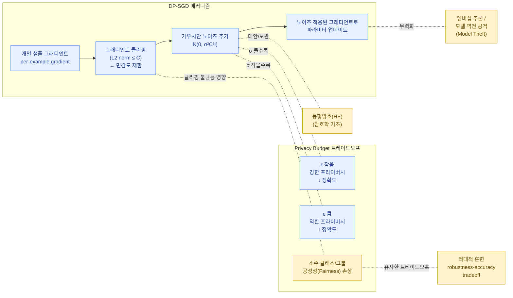

차분 프라이버시(Differential Privacy, DP)는 데이터 분석/모델 학습 결과로부터 **특정 개인의 데이터가 학습에 포함되었는지 여부를 통계적으로 구분하기 어렵게 만드는** 수학적 프라이버시 보장 체계입니다. AI 보안 관점에서는 [모델 탈취 / 멤버십 추론(Model Theft / Membership Inference)](../../attacks/model-theft/) 및 모델 역전(Model Inversion) 공격에 대한 핵심 방어 수단으로 자리잡았습니다.


차분 프라이버시는 "데이터를 익명화하는 기법"이 아니라, **알고리즘(또는 메커니즘) 자체가 가지는 수학적 속성**입니다. 즉 "이 데이터셋은 DP를 만족한다"가 아니라 "이 학습 알고리즘은 ε-DP를 만족한다"고 표현하는 것이 정확합니다.




## 1. 정의: ε-차분 프라이버시

두 데이터셋 `D`와 `D'`가 단 하나의 레코드(한 사람의 데이터)만 다를 때(인접 데이터셋, neighboring datasets), 메커니즘 `M`이 다음을 만족하면 `M`은 **ε-차분 프라이버시**를 만족한다고 합니다.

```
P[ M(D)  ∈ S ]  ≤  e^ε · P[ M(D') ∈ S ]      (모든 가능한 출력 집합 S에 대해)
```

직관적으로:

- 데이터셋에 한 사람의 데이터가 포함되든(D) 포함되지 않든(D'), 메커니즘의 출력 분포는 **거의 비슷해야** 한다.
- ε(엡실론)이 작을수록 두 분포의 차이가 작아져 → **프라이버시 보장이 강함**
- ε이 클수록 D와 D'의 출력 차이가 커질 수 있어 → **프라이버시 보장이 약함** (대신 결과는 더 정확/유용)

실제로는 작은 확률로 위 부등식이 깨지는 것을 허용하는 **(ε, δ)-DP**가 더 널리 사용됩니다. 여기서 `δ`는 "프라이버시 보장이 실패할 확률의 상한"으로, 일반적으로 데이터셋 크기의 역수보다 훨씬 작은 값(예: 10^-5)으로 설정합니다.

### 핵심 성질

- **후처리에 닫혀있음(Post-processing immunity)**: DP를 만족하는 출력에 어떤 후처리를 가해도 DP 보장은 유지된다 (악화되지 않음)
- **합성(Composition)**: 여러 개의 DP 메커니즘을 결합하면, 전체 ε은 각 메커니즘의 ε들의 합(또는 더 정교한 합성 정리에 따른 값)으로 누적된다 → "프라이버시 예산을 소비한다"는 개념의 근거

## 2. DP-SGD: 모델 학습에 DP 적용하기

딥러닝 모델 학습에 DP를 적용하는 가장 표준적인 방법은 **DP-SGD (Differentially Private Stochastic Gradient Descent)** 입니다 (Abadi et al., 2016).

### 일반 SGD와의 차이

일반적인 미니배치 SGD는 각 샘플의 그래디언트를 평균하여 파라미터를 업데이트합니다. DP-SGD는 여기에 두 가지 핵심 단계를 추가합니다.

1. **그래디언트 클리핑 (Per-example Gradient Clipping)**
   - 미니배치 내 각 샘플 `i`에 대해 개별적으로 그래디언트 `g_i = ∇L(θ, x_i)`를 계산
   - 각 `g_i`의 L2 norm을 임계값 `C`로 클리핑: `g_i ← g_i / max(1, ||g_i||_2 / C)`
   - 이렇게 하면 어떤 한 개인의 데이터(이상치 포함)도 그래디언트 업데이트에 과도한 영향을 줄 수 없게 됨 → 민감도(sensitivity)를 `C`로 제한

2. **노이즈 추가 (Gaussian Noise Injection)**
   - 클리핑된 그래디언트들을 합산한 뒤, 평균이 0이고 표준편차가 `σ·C`인 가우시안 노이즈를 더함
   - `g̃ = (1/L) ( Σ_i g_i_clipped + N(0, σ²C²I) )`
   - 이 노이즈가 "한 개인의 데이터가 있었는지/없었는지를 출력으로부터 구분하기 어렵게" 만드는 핵심 메커니즘

3. 노이즈가 추가된 그래디언트 `g̃`로 일반적인 경사하강 업데이트 수행

### 모멘트 회계 (Moments Accountant)

DP-SGD는 학습 과정에서 수많은 반복(iteration)을 거치므로, 단순 합성 정리를 적용하면 누적 ε이 매우 빠르게 커집니다. Abadi et al.은 **Moments Accountant**(이후 RDP, Rényi Differential Privacy 기반 회계 기법으로 발전)라는 더 타이트한 분석 방법을 제안하여, 동일한 노이즈 수준에서 훨씬 적은 ε으로 동일한 학습 횟수를 수행할 수 있음을 보였습니다. TensorFlow Privacy, Opacus(PyTorch) 등의 라이브러리가 이를 구현하고 있습니다.

## 3. Privacy Budget(ε) 트레이드오프

ε은 단순한 하이퍼파라미터가 아니라 **"얼마나 많은 프라이버시를 비용으로 지불할 것인가"를 나타내는 예산**입니다.

| ε 값 | 의미 | 실무 영향 |
|---|---|---|
| ε ≈ 0.1~1 | 매우 강한 프라이버시 보장 | 모델 정확도가 크게 저하될 수 있음 (특히 고차원/소규모 데이터셋) |
| ε ≈ 1~10 | "합리적" 수준으로 자주 사용되는 범위 | 정확도와 프라이버시 사이의 실무적 균형점 |
| ε > 10 | 약한 프라이버시 보장 | 정확도 손실은 적지만, 이론적 보장의 의미가 약해짐 |

트레이드오프가 발생하는 이유:

- **노이즈와 정확도**: ε을 줄이려면(프라이버시 강화) σ(노이즈 표준편차)를 키워야 하고, 노이즈가 클수록 그래디언트 추정이 부정확해져 수렴 속도와 최종 정확도가 저하됨
- **클리핑과 학습 신호**: 클리핑 임계값 `C`가 너무 작으면 정상적인 그래디언트 정보까지 손실되어 학습이 둔화됨
- **데이터셋 크기**: 데이터셋이 클수록(배치 크기가 클수록) 동일한 ε에서 노이즈 대비 신호 비율이 좋아짐 → DP는 일반적으로 **대규모 데이터셋에서 더 실용적**

### 공정성(Fairness) 이슈

DP-SGD가 추가하는 노이즈와 클리핑은 모델 전체에 균등하게 영향을 주지 않습니다.

- **소수 클래스/소수 그룹**에 대한 그래디언트 신호는 원래도 약한데, 여기에 노이즈가 더해지면 상대적으로 더 큰 비율로 신호가 손상됨
- 결과적으로 DP 모델은 **다수 클래스보다 소수 클래스에서 정확도가 더 크게 하락**하는 경향이 여러 연구에서 보고됨 (Bagdasaryan et al., "Differential Privacy Has Disparate Impact on Model Accuracy")
- 이는 [적대적 훈련](../adversarial-training/)의 robustness-accuracy tradeoff와 유사하게, "프라이버시-정확도-공정성"이라는 삼중 트레이드오프로 이해해야 함을 시사함

## 4. 멤버십 추론 / 모델 역전 공격에 대한 방어 효과

DP는 [모델 탈취/멤버십 추론](../../attacks/model-theft/) 공격이 의존하는 핵심 가정을 직접적으로 무력화합니다.

- **멤버십 추론 공격**(Membership Inference Attack, MIA)의 기본 원리는 "모델이 훈련에 사용된 데이터(member)에 대해 더 확신에 찬(overconfident) 출력을 낸다"는 점을 이용합니다. DP-SGD는 개별 샘플이 모델에 미치는 영향을 ε으로 제한하므로, 이론적으로 MIA의 성공률(advantage)을 ε에 비례한 상한으로 묶을 수 있습니다.
- **모델 역전 공격**(Model Inversion)은 모델 파라미터나 출력으로부터 훈련 데이터의 특징(예: 얼굴 이미지)을 재구성하려 시도합니다. DP는 개별 데이터 포인트의 "기억(memorization)"을 억제하므로, 재구성 공격의 충실도를 떨어뜨리는 효과가 있습니다.
- 다만 ε이 충분히 작지 않으면(즉 프라이버시 예산이 넉넉하면) 실질적인 방어 효과는 제한적일 수 있으며, "DP를 적용했다"는 사실만으로 안전성을 보장할 수는 없고 **구체적인 ε 값과 위협 모델**을 함께 평가해야 합니다.

## 5. 동형 암호(Homomorphic Encryption)와의 비교

DP는 프라이버시 문제에 대한 유일한 암호학적/통계적 접근이 아닙니다. [동형 암호(Homomorphic Encryption)](../../foundations/cryptography/)는 전혀 다른 위협 모델을 다룹니다.

| 항목 | 차분 프라이버시 (DP) | 동형 암호 (HE) |
|---|---|---|
| 보호 대상 | 통계적 추론으로부터 개인 데이터 노출 방지 | 데이터의 기밀성(암호화 상태 유지) |
| 보장 방식 | 출력에 통계적 노이즈 추가 (확률적 보장) | 암호문 상에서 직접 연산 (계산적 보장) |
| 성능 영향 | 모델 정확도 저하 (노이즈로 인한) | 연산 속도/메모리 오버헤드가 매우 큼 (특히 FHE) |
| 정보 손실 | 결과 자체에 의도적 노이즈 포함 | 복호화하면 정확한 원래 결과를 얻음 (정보 손실 없음) |
| 주요 활용 | 통계 공개, ML 모델 학습/배포 | 클라우드에서 암호화된 데이터에 대한 위탁 연산, 연합학습 보안 강화 |

두 기법은 상호 배타적이지 않으며, 실무에서는 **연합학습(Federated Learning) + DP + 동형암호/보안 다자간 계산(MPC)** 을 조합하여 "데이터는 절대 평문으로 노출되지 않으면서, 집계 결과에서도 개인 정보가 추론되지 않도록" 다층 방어를 구성하는 경우가 많습니다. 자세한 암호학적 배경은 [암호학 기초](../../foundations/cryptography/) 페이지를 참고하세요.

## 6. 실무 적용 체크리스트

- [ ] 우리 시스템의 위협 모델에서 ε의 목표 값은 얼마인가? (규제 요구사항, 산업 표준 참고)
- [ ] DP-SGD 적용 시 클리핑 임계값 `C`와 노이즈 배수 `σ`를 데이터셋 특성에 맞게 튜닝했는가?
- [ ] 소수 클래스/그룹에 대한 공정성 영향을 별도로 측정했는가?
- [ ] 누적 프라이버시 예산(여러 학습/배포에 걸친 ε 합산)을 추적하고 있는가?
- [ ] DP 적용 여부와 ε 값을 모델 카드/문서에 명시하여 투명성을 확보했는가?

## 관련 페이지

- 이 방어 기법이 대응하는 공격: [모델 탈취 (Model Theft) / 멤버십 추론](../../attacks/model-theft/)
- 관련 암호학적 배경: [동형 암호 등 암호학 기초](../../foundations/cryptography/)
