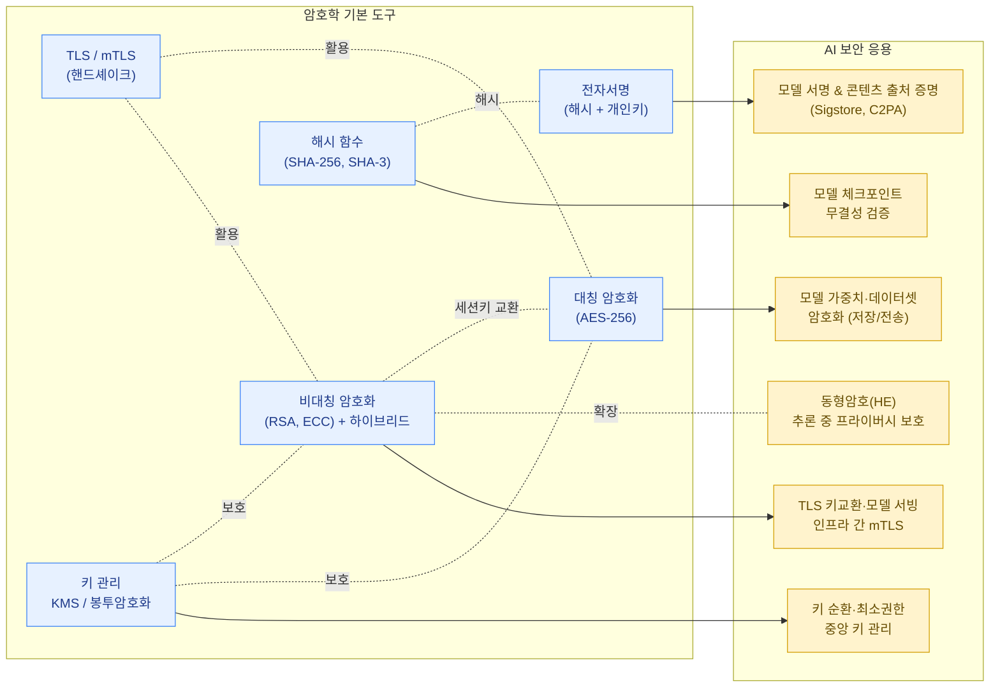

암호학은 데이터의 기밀성(confidentiality), 무결성(integrity), 인증(authentication), 부인 방지(non-repudiation)를 보장하기 위한 수학적 도구입니다. AI 시스템에서는 모델 가중치, 학습 데이터셋, 사용자 입출력, 모델 간 통신 등 보호해야 할 자산이 매우 많기 때문에 암호학의 기본 개념을 정확히 이해하는 것이 중요합니다.

## 대칭 암호화 (Symmetric Encryption)

- 암호화와 복호화에 **동일한 키**를 사용.
- 대표 알고리즘: AES (Advanced Encryption Standard) — 일반적으로 AES-256이 사용됨.
- 장점: 연산 속도가 빠름 — 대용량 데이터(학습 데이터셋, 모델 체크포인트) 암호화에 적합.
- 단점: 키를 어떻게 안전하게 공유/관리할 것인가의 문제(키 배포 문제)가 남음.

## 비대칭 암호화 (Asymmetric / Public-Key Encryption)

- **공개키(Public Key)** 와 **개인키(Private Key)** 의 쌍을 사용. 공개키로 암호화한 데이터는 개인키로만 복호화 가능(또는 그 반대 방향으로 서명).
- 대표 알고리즘: RSA, ECC(타원곡선 암호, Elliptic Curve Cryptography).
- 장점: 키 분배 문제 해결 — 공개키는 누구에게나 공개해도 안전.
- 단점: 연산이 느려 대용량 데이터 직접 암호화에는 비효율적.

### 하이브리드 암호화

실무에서는 두 방식을 결합합니다: 비대칭 암호화로 "세션 키(대칭키)"를 안전하게 교환한 뒤, 실제 데이터는 그 대칭키로 빠르게 암호화합니다. TLS가 대표적인 예입니다.

## 해시 함수 (Hash Function)

입력 데이터를 고정 길이의 출력(다이제스트)으로 변환하는 일방향 함수입니다.

- 특성: **일방향성**(출력에서 입력을 역산할 수 없음), **충돌 저항성**(다른 입력이 같은 출력을 가지기 매우 어려움), **결정성**(같은 입력은 항상 같은 출력).
- 대표 알고리즘: SHA-256, SHA-3. (MD5, SHA-1은 충돌 공격이 발견되어 보안 용도로는 사용 비권장)
- 용도: 비밀번호 저장(salt와 함께), 파일 무결성 검증, 블록체인, 그리고 **모델 체크포인트의 무결성 검증**.


대용량 모델 가중치 파일(수십 GB)을 다운로드할 때, 배포자가 제공한 SHA-256 해시값과 다운로드한 파일의 해시값을 비교하면 전송 중 변조나 손상을 탐지할 수 있습니다. 이는 모델 공급망(supply chain) 보안의 가장 기본적인 단계입니다.


## 전자서명 (Digital Signature)

- 비대칭 암호화를 응용하여 **"누가 만들었는지(인증)"** 와 **"변경되지 않았는지(무결성)"** 를 동시에 증명.
- 동작 원리: 데이터의 해시값을 서명자의 개인키로 암호화 → 서명. 검증자는 서명자의 공개키로 복호화하여 해시값을 비교.
- 용도: 코드 서명, 문서 서명, TLS 인증서, 그리고 **모델 출처 증명(model provenance)**.

## TLS (Transport Layer Security)

웹/API 통신을 암호화하는 표준 프로토콜로, HTTPS의 "S"가 TLS를 의미합니다.

TLS 핸드셰이크의 핵심 흐름(단순화):

1. 클라이언트가 서버에 연결 요청, 지원하는 암호 스위트 목록 전달.
2. 서버가 인증서(공개키 포함, CA가 서명)를 전달.
3. 클라이언트가 인증서를 검증(신뢰 체인 확인).
4. 비대칭 암호화로 세션 키(대칭키)를 안전하게 교환.
5. 이후 모든 통신은 세션 키로 대칭 암호화.

- **TLS 1.2 vs 1.3**: TLS 1.3은 핸드셰이크 과정을 단순화하고, 취약한 암호 스위트를 제거하여 더 빠르고 안전함.
- **mTLS (Mutual TLS)**: 클라이언트도 인증서를 제시하여 서버가 클라이언트를 인증. 서비스 간(service-to-service) 통신, 특히 모델 서빙 인프라 내부 통신에서 자주 사용.

## 키 관리 (Key Management / KMS)

암호화 자체는 알고리즘이 검증되어 있지만, 실제 보안 사고의 대부분은 **키 관리 실패**에서 발생합니다.

- **KMS (Key Management Service)**: AWS KMS, GCP Cloud KMS, HashiCorp Vault 등 — 암호화 키의 생성, 저장, 순환(rotation), 폐기를 중앙에서 관리.
- **봉투 암호화(Envelope Encryption)**: 데이터는 데이터 암호화 키(DEK)로, DEK는 다시 키 암호화 키(KEK, KMS에 저장)로 암호화하는 계층 구조. KEK 자체는 HSM(하드웨어 보안 모듈) 안에서만 사용되어 외부로 노출되지 않음.
- **키 순환(Key Rotation)**: 키가 유출되었을 때 피해를 최소화하기 위해 주기적으로 키를 교체.
- **최소 권한 접근**: 키에 접근할 수 있는 주체(서비스, 사람)를 최소화하고 모든 접근을 로깅.

## AI 맥락에서의 암호학 응용

### 1. 모델 가중치 및 데이터셋 암호화

- 학습된 모델의 가중치 파일은 그 자체로 막대한 R&D 투자의 결과물이자, 경우에 따라 학습 데이터의 정보를 일부 내재하고 있는 자산입니다.
- 저장 시 암호화(encryption at rest)와 전송 중 암호화(encryption in transit)를 모두 적용해야 함.
- 학습 데이터셋에 개인정보(PII)가 포함된 경우, 암호화뿐 아니라 접근 통제와 결합되어야 함.

### 2. 동형암호 (Homomorphic Encryption, HE)

- **개념**: 암호화된 데이터를 복호화하지 않고도 그 데이터에 대해 연산(덧셈, 곱셈 등)을 수행할 수 있는 암호화 방식. 연산 결과를 복호화하면 평문에 대해 같은 연산을 수행한 것과 동일한 결과가 나옴.
- **완전동형암호(FHE, Fully Homomorphic Encryption)**: 임의의 연산을 지원하지만 현재까지는 연산 비용이 매우 큼.
- **AI에서의 응용**: 클라이언트가 데이터를 암호화한 채로 서버에 전송 → 서버는 암호화된 상태로 모델 추론을 수행 → 암호화된 결과를 반환 → 클라이언트만 복호화. 서버는 평문 데이터를 전혀 볼 수 없음.
- **차분 프라이버시와의 관계**: 동형암호는 "연산 과정에서 데이터를 숨기는" 기술이고, [차분 프라이버시(Differential Privacy)](../../defenses/differential-privacy/)는 "연산 결과(통계, 모델)로부터 개별 데이터를 추론할 수 없게 만드는" 기술입니다. 두 기술은 상호 배타적이지 않으며, 함께 적용되어 "입력도 숨기고, 출력에서도 개인정보가 새지 않도록" 하는 방어 심층화(defense in depth)를 구성할 수 있습니다.

### 3. 모델 서명과 콘텐츠/모델 출처 증명 (Model & Content Provenance)

AI 공급망이 복잡해지면서 "이 모델이 정말 신뢰할 수 있는 출처에서 왔는가", "이 이미지/텍스트가 AI로 생성되었는가"를 검증하는 문제가 중요해지고 있습니다.

- **모델 서명(Model Signing)**: 모델 체크포인트를 게시할 때 전자서명을 첨부하여, 사용자가 다운로드 시 서명을 검증함으로써 변조 여부와 게시자를 확인. (예: Sigstore, in-toto와 같은 공급망 무결성 프레임워크가 ML 모델에도 적용되는 추세)
- **콘텐츠 출처 증명(Content Provenance)**: C2PA(Coalition for Content Provenance and Authenticity)와 같은 표준은 이미지/영상 등에 "어떤 도구로, 언제, 어떻게 생성/편집되었는지"에 대한 암호학적으로 서명된 메타데이터를 첨부합니다. 이는 딥페이크 등 AI 생성 콘텐츠의 오용에 대응하기 위한 기술적 토대입니다.
- 두 개념 모두 핵심 메커니즘은 동일합니다: **해시 + 전자서명**을 이용해 "무엇이 변경되지 않았고, 누가 보증했는가"를 암호학적으로 증명하는 것입니다.

## 정리

암호학은 AI 보안에서 직접적인 "공격 기법"으로 다루어지는 경우는 적지만, 다음과 같은 모든 방어의 토대가 됩니다.

- 모델/데이터 자산의 기밀성 보호 (저장/전송 암호화, KMS)
- 공급망 무결성 보장 (해시 검증, 모델 서명)
- 추론 과정에서의 프라이버시 보호 (동형암호, [차분 프라이버시](../../defenses/differential-privacy/))
- 생성 콘텐츠의 신뢰성 확보 (콘텐츠 출처 증명)

이러한 개념들은 이후 [방어 기법](../../defenses/) 섹션에서 구체적인 구현 사례와 함께 다시 등장합니다.
