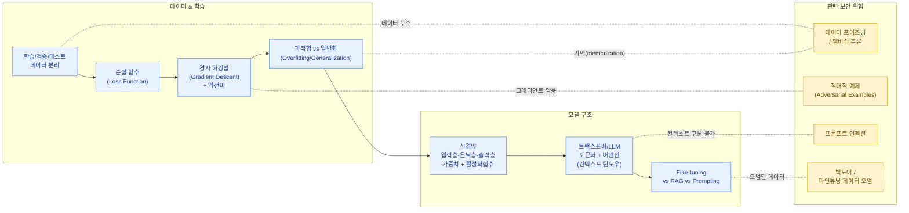

AI 보안을 다루기 위해서는 보안 지식 못지않게 **머신러닝/딥러닝이 실제로 어떻게 동작하는지**에 대한 이해가 필요합니다. 모델을 "입력을 넣으면 답이 나오는 블랙박스"로만 이해하면, 공격이 "왜" 작동하는지, 방어가 "왜" 효과적인지(혹은 왜 한계가 있는지)를 판단할 수 없습니다.

## 머신러닝의 세 가지 기본 패러다임

### 지도학습 (Supervised Learning)

- 입력(X)과 정답(레이블, y)이 쌍으로 주어진 데이터로 학습.
- 모델은 입력으로부터 정답을 예측하는 함수를 학습.
- 예: 이미지 분류(고양이/개), 스팸 메일 분류, 감성 분석.

### 비지도학습 (Unsupervised Learning)

- 레이블 없이 데이터의 숨겨진 구조/패턴을 학습.
- 예: 클러스터링(유사한 데이터 그룹화), 차원 축소, 이상 탐지(정상 패턴에서 벗어난 데이터 식별).
- 보안 영역에서는 네트워크 이상 탐지, 사기 탐지에 자주 사용.

### 강화학습 (Reinforcement Learning, RL)

- 에이전트가 환경과 상호작용하며 행동에 대한 "보상(reward)"을 받고, 누적 보상을 최대화하는 정책(policy)을 학습.
- 핵심 요소: 상태(state), 행동(action), 보상(reward), 정책(policy).
- LLM 학습에서는 **RLHF (Reinforcement Learning from Human Feedback)** 가 대표적 — 사람의 선호도 평가를 보상 신호로 사용하여 모델의 응답을 "더 도움이 되고 안전하게" 조정하는 데 사용됨.

## 신경망의 기본 구조

신경망(Neural Network)은 입력층(input layer), 은닉층(hidden layer), 출력층(output layer)으로 구성된 계층적 함수입니다.

- 각 층은 여러 개의 **뉴런(노드)** 으로 구성되며, 뉴런은 입력의 가중합(weighted sum)에 **활성화 함수(activation function)** 를 적용하여 출력을 생성.
- 대표 활성화 함수: ReLU, Sigmoid, Tanh, (LLM에서는) GELU/SwiGLU 등.
- 층이 여러 개 쌓인 신경망을 **딥러닝(Deep Learning)** 이라 부름 — "딥"은 층의 깊이를 의미.
- **가중치(weights)와 편향(bias)** 이 학습 과정에서 조정되는 파라미터이며, 이것이 바로 "모델 파일"에 저장되는 내용입니다.

## 데이터셋 분리: 학습/검증/테스트

| 데이터셋 | 용도 |
|---|---|
| 학습(Train) 데이터 | 모델의 파라미터(가중치)를 직접 업데이트하는 데 사용 |
| 검증(Validation) 데이터 | 학습 중간에 모델의 일반화 성능을 점검하고, 하이퍼파라미터를 조정하는 데 사용 |
| 테스트(Test) 데이터 | 학습이 끝난 후 최종 성능을 평가 — 학습 과정에서 한 번도 사용되지 않아야 함 |


이 분리가 깨지는 것을 **데이터 누수(Data Leakage)** 라고 하며, 모델이 "학습한 것을 외운(memorize)" 것을 "일반화에 성공한 것"으로 오인하게 만듭니다. 보안 관점에서는 이 누수가 [데이터 포이즈닝](../../attacks/data-poisoning/)이나 멤버십 추론(membership inference) 공격의 평가를 왜곡시키는 원인이 될 수 있습니다.


## 손실 함수와 경사 하강법

### 손실 함수 (Loss Function)

모델의 예측값과 실제 정답 사이의 "오차"를 수치로 표현한 함수입니다.

- 회귀 문제: 평균제곱오차(MSE) 등.
- 분류 문제: 교차 엔트로피(Cross-Entropy) — LLM의 다음 토큰 예측 학습에서도 핵심적으로 사용됨.

### 경사 하강법 (Gradient Descent)

- 손실 함수의 값을 줄이는 방향으로 파라미터(가중치)를 반복적으로 조정하는 최적화 알고리즘.
- **경사(gradient)**: 손실 함수를 각 파라미터에 대해 미분한 값. "어느 방향으로 파라미터를 바꾸면 손실이 줄어드는가"를 알려줌.
- **학습률(learning rate)**: 한 번에 얼마나 크게 파라미터를 업데이트할지 결정하는 하이퍼파라미터.
- **역전파(Backpropagation)**: 출력층의 오차를 입력층 방향으로 거꾸로 전파하며 각 층의 가중치에 대한 경사를 효율적으로 계산하는 알고리즘.


"경사(gradient)"는 적대적 공격(adversarial attack)에서 매우 중요한 개념입니다. 공격자가 모델의 경사 정보에 접근할 수 있다면(white-box), 손실을 "줄이는" 대신 "특정 방향으로 늘리거나, 잘못된 클래스로 향하게" 입력을 미세하게 조정할 수 있습니다 — 이것이 바로 [적대적 예제](../../attacks/adversarial-examples/)의 핵심 원리입니다.


## 과적합과 일반화

- **과적합(Overfitting)**: 모델이 학습 데이터의 패턴(심지어 노이즈까지)을 과도하게 학습하여, 학습 데이터에서는 성능이 매우 높지만 새로운 데이터(테스트 데이터)에서는 성능이 떨어지는 현상.
- **일반화(Generalization)**: 학습하지 않은 새로운 데이터에 대해서도 좋은 성능을 내는 능력 — ML의 진짜 목표.
- 과적합을 줄이는 기법: 정규화(regularization, L1/L2), 드롭아웃(dropout), 데이터 증강(data augmentation), 조기 종료(early stopping).

과적합과 보안의 연결: 모델이 특정 학습 데이터를 "외워버리면(memorization)", 추론 시 그 데이터의 일부를 그대로 노출할 위험이 커집니다. 이는 [데이터 포이즈닝](../../attacks/data-poisoning/) 및 멤버십 추론 공격과 직결되는 문제입니다.

## 트랜스포머와 LLM의 기본 동작 원리

### 토큰화 (Tokenization)

- LLM은 텍스트를 직접 처리하지 않고, 텍스트를 **토큰(token)** — 단어, 부분 단어, 문자 단위의 조각 — 으로 분할한 후 각 토큰을 숫자 ID로 변환하여 처리합니다.
- 예: "안녕하세요"가 하나의 토큰이 아니라 여러 개의 서브워드 토큰으로 분할될 수 있음.
- 토큰화 방식의 차이는 프롬프트 인젝션 탐지 필터의 우회(예: 특수문자나 인코딩을 이용해 필터가 인식하는 토큰 경계를 깨는 기법)와도 연관됩니다.

### 어텐션 (Attention)

- 트랜스포머의 핵심 메커니즘으로, 입력 시퀀스 내의 각 토큰이 "다른 모든 토큰을 얼마나 중요하게 참고할지"를 동적으로 계산합니다.
- **셀프 어텐션(Self-Attention)**: 같은 시퀀스 내의 토큰들 사이의 관계를 계산 — 이를 통해 모델은 문맥(context)을 이해함.
- 이 메커니즘 덕분에 LLM은 시스템 프롬프트, 사용자 입력, 검색된 문서(RAG 컨텍스트) 등 컨텍스트 윈도우 내의 모든 텍스트를 "구분 없이" 함께 참조합니다. 이것이 바로 프롬프트 인젝션이 가능한 근본적인 이유입니다 — 모델 입장에서는 "시스템 지시"와 "외부에서 가져온 텍스트 안에 숨겨진 지시"를 구조적으로 구분하기 어렵습니다.

### Fine-tuning vs RAG vs Prompting

LLM을 특정 목적에 맞게 활용하는 세 가지 대표적인 방법입니다.

| 방법 | 설명 | 특징 |
|---|---|---|
| **프롬프팅(Prompting)** | 입력 프롬프트에 지시사항, 예시, 컨텍스트를 포함시켜 모델의 행동을 유도 | 모델 가중치를 변경하지 않음. 빠르고 유연하지만 컨텍스트 윈도우 제한, 매 요청마다 비용 발생 |
| **RAG (Retrieval-Augmented Generation)** | 외부 데이터 저장소(주로 벡터DB)에서 관련 문서를 검색하여 프롬프트에 동적으로 포함 | 최신 정보/사내 데이터 반영 가능. 검색 단계의 접근 제어, 검색된 문서를 통한 인젝션이 새로운 공격 표면이 됨 |
| **파인튜닝(Fine-tuning)** | 사전학습된 모델을 추가 데이터로 재학습하여 가중치 자체를 조정 | 모델의 행동/지식을 영구적으로 변경. 파인튜닝 데이터셋이 오염되면 모델 자체에 백도어가 심어질 수 있음 ([데이터 포이즈닝](../../attacks/data-poisoning/)) |

## 정리: 왜 이 메커니즘들을 알아야 하는가

이 페이지에서 다룬 개념들은 이후 다룰 공격 기법을 "현상"이 아니라 "원리"로 이해하기 위한 토대입니다.

- **경사 하강법과 손실 함수**의 동작 원리를 알아야, 공격자가 모델의 경사 정보를 이용해 입력을 미세하게 조작하는 [적대적 예제](../../attacks/adversarial-examples/)가 왜 "사람 눈에는 안 보이는 작은 변화로도" 모델을 속일 수 있는지 이해할 수 있습니다.
- **학습 데이터셋의 역할과 일반화**의 개념을 알아야, 학습 데이터에 악의적인 샘플을 섞어 모델의 동작을 왜곡시키는 [데이터 포이즈닝](../../attacks/data-poisoning/)이 왜 효과적이고, 왜 탐지가 어려운지 이해할 수 있습니다.
- **어텐션 메커니즘과 컨텍스트 윈도우**의 동작 원리를 알아야, [프롬프트 인젝션](../../attacks/prompt-injection/)이 단순한 "필터링 문제"가 아니라 LLM 아키텍처에 내재된 근본적인 도전임을 이해할 수 있습니다.

다음 섹션부터는 이러한 기반 지식을 바탕으로, 실제 AI 시스템을 대상으로 하는 구체적인 공격 기법들을 살펴봅니다.
