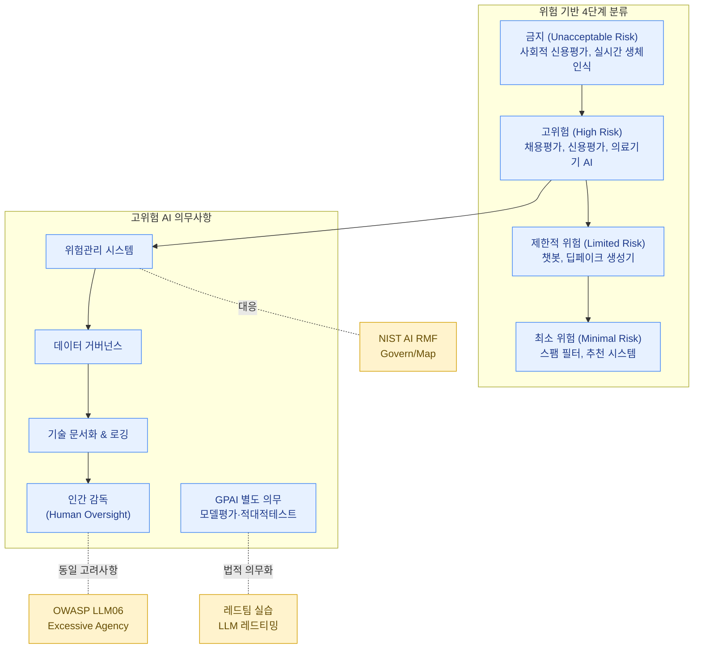

**EU AI Act**(유럽연합 인공지능법)는 AI 시스템에 대한 세계 최초의 포괄적 규제 법안입니다. GDPR이 전 세계 데이터 프라이버시 규제에 영향을 준 것처럼, EU AI Act도 유럽 시장에 제품을 출시하는 모든 기업에게 사실상의 글로벌 표준으로 작동할 가능성이 높습니다. 앞의 세 페이지(OWASP, ATLAS, NIST AI RMF)가 "어떻게 위험을 식별·관리하는가"에 대한 프레임워크였다면, EU AI Act는 "**법적으로 무엇을 반드시 해야 하는가**"를 규정합니다.


EU AI Act는 EU에 본사가 있는 기업뿐 아니라, **EU 시장에 AI 시스템을 제공하거나 EU 거주자에게 영향을 미치는 AI 시스템의 출력을 사용하는 모든 기업**에 적용될 수 있습니다(역외 적용, extraterritorial effect). GDPR과 마찬가지로 "우리는 한국/미국 회사니까 상관없다"는 가정은 위험합니다.


## 위험 기반 분류 체계 (Risk-Based Classification)

EU AI Act의 핵심 설계 철학은 "**모든 AI를 동일하게 규제하지 않고, 위험 수준에 따라 차등 규제한다**"는 것입니다. AI 시스템은 다음 4단계로 분류됩니다.

| 등급 | 정의 | 예시 | 규제 강도 |
|---|---|---|---|
| **금지 (Unacceptable Risk)** | 기본권을 명백히 침해하는 AI | 사회적 신용 평가(social scoring), 실시간 원격 생체인식(공공장소, 제한적 예외 제외), 사람의 취약점을 악용하는 조작적 AI | 사용 자체가 금지 |
| **고위험 (High Risk)** | 안전이나 기본권에 중대한 영향을 미칠 수 있는 AI | 채용/인사 평가, 신용평가, 의료기기에 내장된 AI, 핵심 인프라 제어, 법 집행 관련 AI | 엄격한 사전/사후 의무 |
| **제한적 위험 (Limited Risk)** | 투명성 의무가 적용되는 AI | 챗봇, 딥페이크 생성기, 감정 인식 시스템 | 투명성 고지 의무 (예: "이것은 AI가 생성한 콘텐츠입니다") |
| **최소 위험 (Minimal Risk)** | 그 외 대부분의 AI | 스팸 필터, 추천 시스템 등 | 별도 의무 없음 (자율 규약 권장) |

이 분류는 "기술 자체"가 아니라 "**사용 목적(use case)과 맥락**"을 기준으로 합니다. 같은 컴퓨터 비전 모델이라도 사진 보정 앱에 쓰이면 최소 위험이지만, 채용 후보자의 표정을 분석해 평가에 반영하면 고위험으로 분류될 수 있습니다.

## 고위험 AI 시스템의 의무사항

고위험으로 분류된 AI 시스템의 제공자(provider)는 다음과 같은 의무를 집니다. 이 목록은 OWASP/NIST에서 다루는 기술적 통제와 상당 부분 겹치지만, **법적 의무라는 점에서 무게가 다릅니다.**

| 의무 영역 | 내용 |
|---|---|
| 위험관리 시스템 | 시스템 생애주기 전반에 걸친 위험관리 프로세스 운영 (→ [NIST AI RMF](../nist-ai-rmf/)와 직접 대응) |
| 데이터 거버넌스 | 학습/검증/테스트 데이터의 품질, 대표성, 편향 검토 |
| 기술 문서화 (Documentation) | 시스템의 목적, 아키텍처, 성능, 한계를 상세히 기록한 기술 문서 작성 및 보관 |
| 로깅 (Record-keeping) | 자동으로 로그를 생성·보관하여 추적성(traceability) 확보 |
| 투명성 및 사용자 정보 제공 | 사용자가 AI 시스템과 상호작용하고 있음을 인지할 수 있도록 정보 제공 |
| 인간 감독 (Human Oversight) | 인간이 AI의 출력을 검토하고 개입(override)할 수 있는 장치 마련 |
| 정확성·강건성·사이버보안 | 적절한 수준의 정확성, 강건성, 사이버보안을 갖추도록 설계·테스트 |
| 적합성 평가 (Conformity Assessment) | 시장 출시 전 적합성 평가 절차 수행 및 CE 마킹 |

이 중 "**인간 감독**"과 "**기술 문서화**"는 AI 보안 실무자가 직접 기여할 수 있는 영역입니다. 예를 들어 인간 감독 장치를 설계할 때는 [에이전트의 과도한 자율성(Excessive Agency)](../owasp-llm-top10/) 문제와 동일한 고려사항이 적용됩니다.

## GPAI(범용 AI) 모델에 대한 별도 의무

EU AI Act는 특정 "사용 목적"에 묶이지 않는 **범용 AI 모델(General-Purpose AI, GPAI)** — 즉 대형 파운데이션 모델 — 에 대해서도 별도의 의무를 부과합니다. 이는 모델을 직접 개발/배포하는 회사뿐 아니, 해당 모델을 기반으로 애플리케이션을 만드는 회사(다운스트림 제공자)에도 영향을 줍니다.

| 대상 | 의무 |
|---|---|
| 모든 GPAI 모델 제공자 | 기술 문서 작성, 저작권 정책 준수, 학습에 사용된 콘텐츠 요약 공개 |
| **시스테믹 리스크**(systemic risk)를 가진 GPAI (대규모 컴퓨팅으로 학습된 최상위 모델) | 모델 평가(model evaluation) 및 적대적 테스트(adversarial testing) 수행, 중대 사고 보고, 사이버보안 보호 조치, 에너지 소비 보고 |

"적대적 테스트 수행 의무"는 이 지식베이스의 [레드팀·실전 경험](../../red-teaming/) 섹션에서 다루는 실습 활동이 **법적 요구사항으로 직결되는 지점**입니다. 즉 레드팀 활동은 더 이상 "선택적 모범 사례"가 아니라, 일부 모델에 대해서는 "법적 의무 이행을 위한 증거"가 됩니다.

## 시행 일정 개요

EU AI Act는 단계적으로 시행됩니다. 정확한 날짜는 변경될 수 있으므로 항상 최신 공식 자료를 확인해야 하지만, 학습 차원에서 기억할 흐름은 다음과 같습니다.

| 단계 | 적용 대상 |
|---|---|
| 발효 후 단기 (약 6개월) | "금지(Unacceptable Risk)" 항목 적용 시작 |
| 발효 후 1년 | GPAI 모델 관련 의무 적용 시작 |
| 발효 후 2년 | 대부분의 고위험 AI 시스템 의무 본격 적용 |
| 발효 후 3년 이상 | 일부 특정 카테고리(기존 제품에 내장된 AI 등)에 대한 의무 적용 |


시행 일정은 학습용 개요이며, 실제 적용 시점과 세부 예외조항은 EU AI Act 본문 및 후속 가이드라인을 통해 반드시 확인해야 합니다. 규제 환경은 계속 업데이트됩니다.


## 글로벌 기업 입장에서의 컴플라이언스 시사점

EU AI Act를 학습할 때 가장 가치 있는 관점은 "조문을 외우는 것"이 아니라, "**이 법이 우리 회사의 AI 개발/운영 프로세스에 어떤 변화를 요구하는가**"를 이해하는 것입니다.

1. **분류 작업이 선행되어야 한다**: 회사가 만들거나 사용하는 모든 AI 기능을 위 4단계 등급으로 분류하는 작업 자체가 첫 단계입니다. 이 작업은 [AI 위험 등록부 작성](../ai-risk-register/) 실습과 정확히 같은 작업입니다.
2. **문서화는 보안팀의 일이 된다**: 기술 문서화, 로깅, 위험관리 시스템 운영은 전통적으로 법무/컴플라이언스 팀의 일로 여겨졌지만, 실제 내용을 작성할 수 있는 사람은 AI 보안/엔지니어링 역량을 가진 사람입니다.
3. **NIST AI RMF와의 매핑이 실무의 핵심**: 미국 기업이 EU 시장에 진출할 때, "우리는 이미 NIST AI RMF를 따르고 있는데 EU AI Act 요구사항은 얼마나 겹치는가?"라는 질문이 자주 나옵니다. 두 프레임워크의 단계(Govern/Map/Measure/Manage ↔ 위험관리시스템/데이터거버넌스/문서화 등)를 매핑할 수 있는 사람은 컴플라이언스 비용을 크게 줄여줄 수 있습니다. → [NIST AI RMF](../nist-ai-rmf/)에서 다룬 4단계 구조를 다시 참고하세요.
4. **공급망 전체에 영향을 준다**: 다운스트림 제공자(파운데이션 모델을 가져다 쓰는 회사)도 GPAI 의무의 영향을 받으므로, [공급망 리스크](../../infrastructure/supply-chain-risk/)에서 다룬 "모델 제공자가 어떤 정보를 제공하는가"에 대한 점검이 컴플라이언스 작업의 일부가 됩니다.


**핵심 요약**: EU AI Act는 "AI 보안"과 "AI 컴플라이언스"의 경계를 허무는 법입니다. 위험 분류, 문서화, 인간 감독, 적대적 테스트라는 요구사항은 모두 이 섹션의 다른 페이지(OWASP, ATLAS, NIST AI RMF)에서 다룬 활동과 직접 연결됩니다. 이 연결을 한 장의 매핑 표로 정리할 수 있다면, 그 자체로 강력한 포트폴리오 산출물이 됩니다.

