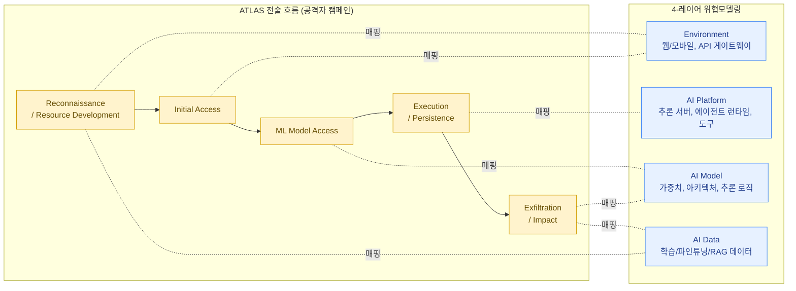

**MITRE ATLAS**(Adversarial Threat Landscape for Artificial-Intelligence Systems)는 AI/ML 시스템을 겨냥한 공격자의 전술(Tactics)과 기법(Techniques)을 정리한 지식베이스입니다. 보안 업계에서 널리 쓰이는 **MITRE ATT&CK**(전통적인 IT 시스템에 대한 공격자 행동 매트릭스)의 AI 확장판이라고 보면 됩니다.

OWASP LLM Top 10이 "어떤 취약점이 존재하는가"를 다룬다면, ATLAS는 "**공격자가 그 취약점을 어떻게, 어떤 순서로 악용하는가**"를 다룹니다. 즉 OWASP는 정적인 체크리스트에 가깝고, ATLAS는 공격자의 캠페인을 시간순으로 재구성하는 데 유용한 동적 모델입니다.


ATT&CK을 알고 있다면 ATLAS의 구조가 매우 친숙하게 느껴질 것입니다. 같은 "전술(Tactic) → 기법(Technique) → 절차(Procedure)" 계층 구조를 사용하며, 일부 전술 이름도 ATT&CK과 동일합니다(Reconnaissance, Initial Access, Exfiltration 등). 차이는 "ML 모델/데이터/파이프라인"이라는 새로운 자산 유형을 대상으로 한다는 점입니다.


## 주요 전술(Tactics) 예시

ATLAS는 공격자가 목표를 달성하기 위해 거치는 단계를 전술 단위로 정리합니다. 아래는 학습 목적으로 자주 인용되는 핵심 전술들입니다.

| 전술 (Tactic) | 의미 | AI 시스템에서의 예시 |
|---|---|---|
| Reconnaissance | 공격 대상에 대한 정보 수집 | 모델 카드, API 문서, 논문에서 아키텍처/학습 데이터 정보를 수집 |
| Resource Development | 공격에 필요한 자원/인프라 준비 | 가짜 데이터셋, 악성 파인튜닝 어댑터, 가짜 패키지 제작 |
| Initial Access | 시스템에 최초 접근 확보 | 공개 API에 계정 생성, 취약한 플러그인을 통한 진입 |
| ML Model Access | 모델 자체에 대한 접근 권한 확보 | API 호출 권한, 모델 가중치 파일 접근, 화이트박스/블랙박스 접근 구분 |
| Execution | 악의적 페이로드 실행 | 프롬프트 인젝션을 통해 의도하지 않은 도구 호출 유발 |
| Persistence | 접근 권한을 지속적으로 유지 | RAG 인덱스나 메모리에 영속적인 악성 지시 삽입 |
| Exfiltration | 데이터/모델 정보 유출 | 멤버십 추론, 모델 추출, 시스템 프롬프트 유출 |
| Impact | 최종 피해 발생 | 모델 성능 저하, 잘못된 의사결정 유도, 서비스 거부(DoS) |


실제 ATLAS 매트릭스는 위 표보다 훨씬 세분화되어 있으며(각 전술마다 다수의 기법과 하위 기법, 그리고 실제 사례 케이스 스터디가 연결됨), 버전이 계속 업데이트됩니다. 이 표는 "전술의 흐름을 이해하기 위한 학습용 요약"이며, 실무에서는 [MITRE ATLAS 공식 사이트](https://atlas.mitre.org/)의 매트릭스를 직접 참고해야 합니다.


## 위협모델링에 ATLAS를 적용하는 방법: 4-레이어 모델

ATLAS를 처음 접하면 "전술/기법이 너무 많아서 어디서부터 시작해야 할지 모르겠다"는 느낌을 받기 쉽습니다. 실무에서 효과적인 접근은, 먼저 **분석 대상 시스템을 4개의 레이어로 분해**한 뒤, 각 레이어별로 어떤 ATLAS 전술이 적용 가능한지 매핑하는 것입니다.

### 레이어 정의

| 레이어 | 정의 | 예시 구성요소 |
|---|---|---|
| Environment | 시스템이 운영되는 외부 환경 및 사용자와의 접점 | 웹/모바일 클라이언트, API 게이트웨이, 인증 시스템 |
| AI Platform | 모델을 서빙/운영하는 인프라 계층 | 추론 서버, 오케스트레이션 프레임워크, 에이전트 런타임, 도구(tool) 연동 |
| AI Model | 모델 자체 (가중치, 아키텍처, 추론 로직) | 파운데이션 모델, 파인튜닝된 어댑터, 임베딩 모델 |
| AI Data | 학습/운영에 사용되는 데이터 | 학습 데이터셋, 파인튜닝 데이터, RAG 문서, 벡터 인덱스, 로그 |

### 레이어별 전술 매핑 예시

| 레이어 | 주로 매핑되는 ATLAS 전술 | 위협모델링 질문 |
|---|---|---|
| Environment | Reconnaissance, Initial Access, Resource Development | "공격자가 우리 서비스에 대해 무엇을 알아낼 수 있는가? 익명으로 접근 가능한 진입점은 어디인가?" |
| AI Platform | Execution, Persistence, ML Model Access | "에이전트가 호출할 수 있는 도구는 무엇이고, 그 도구를 통해 어떤 영속적 변화를 만들 수 있는가?" |
| AI Model | ML Model Access, Exfiltration | "모델 가중치나 추론 API에 대한 접근 통제는 충분한가? 모델을 통해 학습 데이터를 추론할 수 있는가?" |
| AI Data | Resource Development, Persistence, Impact | "학습 데이터나 RAG 인덱스에 누가 쓰기 권한을 가지는가? 오염된 데이터가 들어가면 무엇이 잘못되는가?" |

### 적용 절차 (요약)

1. **시스템을 위 4개 레이어로 분해**합니다. 각 레이어에 속한 실제 구성요소(서비스, 데이터베이스, API 등)를 나열합니다.
2. **각 레이어에 적용 가능한 ATLAS 전술을 매핑**합니다. 모든 전술이 모든 레이어에 적용되는 것은 아니므로, 매핑이 안 되는 전술은 비워둡니다.
3. **각 매핑 셀마다 구체적인 공격 시나리오를 1~2개 작성**합니다. (예: "AI Platform × Execution → 사용자가 업로드한 문서에 포함된 지시문이 에이전트의 파일 삭제 도구를 호출하게 만든다")
4. **시나리오별로 현재 통제 수준과 잔여 위험을 평가**합니다.

이 절차는 다음 페이지인 [NIST AI RMF](../nist-ai-rmf/)의 "Map" 단계와 직접 연결되며, 실습 페이지인 [AI 위험 등록부 작성하기](../../../labs/lab3-ai-risk-register/)에서 산출물 형태로 정리됩니다.


**손으로 직접 해보는 것이 중요합니다.** 위 4단계 절차를 실제 시스템(또는 가상의 RAG 챗봇)에 적용해보는 핸즈온 위협모델링 실습은 [LLM 레드티밍](../../red-teaming/llm-red-teaming/) 페이지에서 다룹니다. ATLAS는 읽는 것만으로는 체화되지 않으며, 직접 매핑 표를 채워봐야 비로소 "이 시스템의 약한 지점이 어디인지"가 보이기 시작합니다.


## ATLAS를 어디까지 알아야 하는가

면접이나 실무에서 ATLAS와 관련해 자주 나오는 기대치는 다음 정도입니다.

- ATLAS가 ATT&CK의 AI 확장이라는 것과, 전술/기법/절차 구조를 안다.
- 주요 전술 5~6개(Reconnaissance, Initial Access, ML Model Access, Execution, Exfiltration, Impact)의 의미와 예시를 설명할 수 있다.
- 위 4-레이어 모델처럼, **자신이 속한 조직의 AI 시스템에 ATLAS를 적용해 본 경험**(또는 적용 방법에 대한 명확한 설명)이 있다.

ATLAS 전체 매트릭스를 암기하는 것은 비현실적이고 실익도 적습니다. 대신 "전술 흐름을 이해하고, 그것을 우리 시스템 레이어에 매핑할 수 있다"는 점을 보여주는 것이 훨씬 강력합니다.
