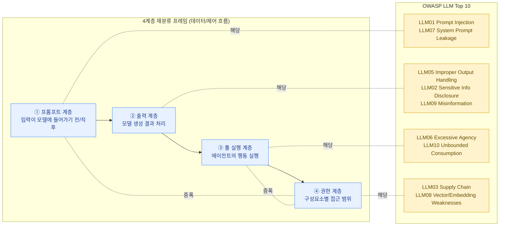

OWASP(Open Worldwide Application Security Project)의 **LLM Applications Top 10**은 LLM 기반 애플리케이션에서 가장 빈번하게 발생하는 취약점 10가지를 정리한 목록입니다. 전통적인 OWASP Top 10(웹 애플리케이션)이 SQL 인젝션, XSS 같은 항목을 다루듯, LLM Top 10은 프롬프트 인젝션, 과도한 권한 위임(Excessive Agency) 같은 LLM 특화 취약점을 다룹니다.


OWASP LLM Top 10은 버전이 계속 업데이트됩니다(2023년 초안 → 2025년 버전 등). 항목 번호와 명칭이 버전에 따라 조금씩 바뀔 수 있으니, **항목명을 외우는 것보다 "이 위험이 어떤 계층에서 발생하는가"를 이해하는 것**이 훨씬 중요합니다. 이 페이지의 후반부에서 그 재분류 프레임을 다룹니다.


## 10개 항목 한눈에 보기

| 코드 | 항목명 (영문) | 한 줄 설명 |
|---|---|---|
| LLM01 | Prompt Injection | 입력(사용자, 외부 문서, 도구 결과 등)에 악의적 지시를 삽입해 모델의 의도를 가로채는 공격 |
| LLM02 | Sensitive Information Disclosure | 모델이 학습 데이터, 시스템 프롬프트, PII 등 민감 정보를 응답에 노출 |
| LLM03 | Supply Chain | 학습 데이터, 파인튜닝 어댑터, 오픈소스 모델, 플러그인 등 공급망 구성요소의 취약점/오염 |
| LLM04 | Data and Model Poisoning | 학습/파인튜닝/RAG 인덱스 데이터를 오염시켜 모델 동작을 왜곡 |
| LLM05 | Improper Output Handling | 모델 출력을 검증 없이 다운스트림(쉘, DB, 브라우저, 다른 시스템)에 그대로 전달 |
| LLM06 | Excessive Agency | LLM 에이전트에게 필요 이상의 권한·도구·자율성을 부여 |
| LLM07 | System Prompt Leakage | 시스템 프롬프트에 포함된 비밀(정책, 자격증명, 내부 로직)이 유출 |
| LLM08 | Vector and Embedding Weaknesses | RAG에서 사용하는 벡터DB/임베딩의 접근통제 미흡, 임베딩 역공학 등 |
| LLM09 | Misinformation | 모델이 그럴듯하지만 사실이 아닌 정보(confabulation/hallucination)를 생성 |
| LLM10 | Unbounded Consumption | 입력/출력 토큰, 호출 횟수에 제한이 없어 DoS나 과도한 비용 청구로 이어짐 |


이 표는 학습용 참고 자료입니다. 실무에서는 항상 [OWASP GenAI Security Project](https://genai.owasp.org/)의 최신 버전을 확인하세요. 버전마다 항목 통합/분리, 명칭 변경이 있습니다.


## 핵심 학습 포인트: 4계층 재분류 프레임

10개 항목을 순서대로 외우는 것은 시험에는 도움이 될 수 있지만, **실제 위협모델링이나 코드 리뷰에서는 거의 쓸모가 없습니다.** 왜냐하면 실제 시스템을 분석할 때 우리는 "이건 LLM01인가 LLM06인가?"를 고민하는 게 아니라, "이 코드가 어느 계층(layer)에서 동작하고, 그 계층에 어떤 통제가 있는가?"를 봐야 하기 때문입니다.

그래서 이 지식베이스에서는 OWASP의 10개 항목을 **시스템의 데이터/제어 흐름상 4개 계층**으로 재분류합니다. 이 재분류 자체가 이 페이지의 핵심 학습 목표입니다.

### 1) 프롬프트 계층 (Prompt Layer) — 입력이 모델에 들어가기 전/직후

모델에게 전달되는 입력(시스템 프롬프트, 사용자 입력, RAG 검색 결과, 도구 응답 등)을 다루는 계층입니다.

| 관련 항목 | 설명 |
|---|---|
| LLM01 Prompt Injection | 입력 어딘가에 악의적 지시가 섞여 들어옴 |
| LLM07 System Prompt Leakage | 입력 계층에 있는 비밀이 출력으로 새어나감 |
| LLM04 Data and Model Poisoning (RAG 인덱스 측면) | 검색 대상 문서 자체가 오염됨 |

→ 자세한 공격 메커니즘은 [프롬프트 인젝션](../../attacks/prompt-injection/)과 [탈옥](../../attacks/jailbreak/) 페이지를 참고하세요.

### 2) 출력 계층 (Output Layer) — 모델이 생성한 결과를 다루는 단계

모델이 만들어낸 텍스트/코드/명령을 어떻게 검증하고 표시하는지에 관한 계층입니다.

| 관련 항목 | 설명 |
|---|---|
| LLM05 Improper Output Handling | 출력을 그대로 실행/렌더링하여 XSS, 명령 실행 등으로 이어짐 |
| LLM02 Sensitive Information Disclosure | 출력에 민감 정보가 포함됨 |
| LLM09 Misinformation | 출력 내용 자체의 사실성/신뢰성 문제 |

→ 출력 검증이 빠졌을 때의 결과는 [프롬프트 인젝션](../../attacks/prompt-injection/) 사례에서 함께 다룹니다(인젝션된 지시가 출력으로 이어지고, 검증 없이 실행되는 체인 구조).

### 3) 툴 실행 계층 (Tool Execution Layer) — 에이전트가 실제로 행동을 일으키는 단계

LLM이 단순 텍스트 생성을 넘어 함수 호출, API 호출, 셸 명령, 파일 시스템 접근 등을 수행하는 계층입니다. 에이전트형 시스템에서 가장 위험한 계층입니다.

| 관련 항목 | 설명 |
|---|---|
| LLM06 Excessive Agency | 에이전트가 필요 이상의 도구/액션을 보유 |
| LLM10 Unbounded Consumption | 도구 호출이 무제한으로 반복되어 자원 고갈 |
| LLM05 Improper Output Handling (실행 측면) | 모델 출력이 검증 없이 명령으로 실행됨 |

### 4) 권한 계층 (Permission / Identity Layer) — 누가, 무엇을, 어떤 범위까지 할 수 있는가

모델/에이전트/플러그인/벡터DB 등 구성요소 각각에 부여된 자격증명과 접근 범위에 관한 계층입니다. 이 계층의 설계 오류는 다른 모든 계층의 문제를 증폭시킵니다.

| 관련 항목 | 설명 |
|---|---|
| LLM03 Supply Chain | 외부 구성요소(모델, 플러그인, 데이터셋)에 대한 신뢰 경계 설정 |
| LLM08 Vector and Embedding Weaknesses | 벡터DB 접근통제, 멀티테넌시 격리 |
| LLM06 Excessive Agency (권한 측면) | 에이전트의 자격증명 범위(scope) 설계 |

## 재분류가 주는 실익

이 4계층 프레임으로 시스템을 보면, 다음과 같은 질문을 자연스럽게 던질 수 있습니다.

- **프롬프트 계층**: "이 시스템에 들어오는 입력 소스를 모두 나열할 수 있는가? 그 중 사용자가 통제할 수 있는 것은 무엇인가?"
- **출력 계층**: "모델 출력을 사용하기 전에 어떤 검증/이스케이프/구조화(JSON 스키마 강제 등)가 있는가?"
- **툴 실행 계층**: "에이전트가 호출할 수 있는 도구 목록은 최소한인가? 호출 빈도/비용에 상한이 있는가?"
- **권한 계층**: "각 구성요소(모델 API 키, 벡터DB, 플러그인)는 최소 권한 원칙을 따르는가?"

이 4가지 질문에 답할 수 있다면, OWASP 항목 번호를 정확히 외우지 못해도 위험을 식별하고 의사소통할 수 있습니다. 또한 새로운 취약점이 발견되었을 때도 "이건 어느 계층의 문제인가"로 빠르게 분류할 수 있습니다.


연관 공격 기법: [프롬프트 인젝션](../../attacks/prompt-injection/) · [탈옥](../../attacks/jailbreak/) · [모델 탈취 및 추출](../../attacks/model-theft/) · [데이터 포이즈닝](../../attacks/data-poisoning/)

다음 페이지인 [MITRE ATLAS](../mitre-atlas/)에서는 이 4계층을 "공격자가 어떤 순서로 노리는가"라는 시간축 관점에서 다시 살펴봅니다.


여기서 식별한 4계층 위험 분류는 [Lab 3: AI 위험 등록부 작성하기](../../../labs/lab3-ai-risk-register/)의 "입력 데이터 / 툴 권한" 항목을 채울 때 그대로 사용됩니다.
