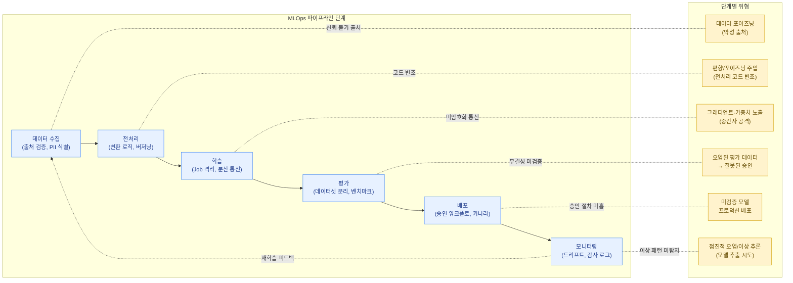

ML 모델은 한 번 학습되어 끝나는 것이 아니라, **데이터 수집 → 전처리 → 학습 → 평가 → 배포 → 모니터링**으로 이어지는 반복적인 파이프라인을 통해 지속적으로 갱신됩니다. 이 파이프라인을 자동화하는 것이 MLOps이며, 전통적인 CI/CD 파이프라인과 마찬가지로 **각 단계마다 고유한 공격 표면과 접근 제어 요구사항**이 존재합니다.


MLOps 파이프라인은 코드(파이프라인 정의), 데이터(학습/평가 데이터셋), 모델(가중치 아티팩트), 인프라(컴퓨팅 클러스터, 오케스트레이션 도구)가 모두 얽혀 있는 **복합 자산**입니다. 전통적인 CI/CD 보안 사고에서는 코드 저장소만 노리면 됐지만, ML 파이프라인에서는 데이터 저장소, 실험 추적 서버, 모델 레지스트리까지 공격 표면이 확장됩니다.


## ML 파이프라인 단계별 보안 고려사항

### 1. 데이터 수집 (Data Collection)

- **출처 검증**: 외부 크롤링, 제3자 제공 데이터, 사용자 생성 데이터(UGC) 등 수집 경로별로 신뢰 수준이 다릅니다. 신뢰할 수 없는 출처의 데이터가 학습 파이프라인에 직접 들어가면 [데이터 포이즈닝](../../attacks/data-poisoning/) 공격의 진입점이 됩니다.
- **수집 파이프라인 접근 제어**: 데이터 수집 작업(크롤러, ETL job)의 자격 증명이 탈취되면 공격자가 악성 데이터를 주입하거나, 반대로 민감 데이터를 외부로 유출시킬 수 있습니다.
- **PII/민감정보 식별**: 수집 단계에서 개인정보·기밀정보를 식별하고 태깅해 두어야, 이후 단계에서 비식별화나 접근 제어 정책을 적용할 수 있습니다.

### 2. 전처리 (Preprocessing)

- **변환 로직의 무결성**: 전처리 스크립트(토큰화, 정규화, 피처 엔지니어링 코드)는 모델의 입력 분포를 결정합니다. 이 코드가 변조되면 학습 데이터 자체를 건드리지 않고도 모델 동작을 왜곡할 수 있습니다.
- **데이터 버저닝**: 전처리 전/후 데이터셋에 버전을 부여하고 해시를 기록해, 추후 "어떤 데이터로 학습했는지"를 역추적할 수 있어야 합니다(재현성 + 사고 대응).
- **샘플링/필터링 규칙의 검토**: 특정 라벨이나 소스를 의도적으로 과대/과소 표집하는 코드 변경은 미묘한 편향 주입(poisoning)으로 이어질 수 있습니다.

### 3. 학습 (Training)

- **학습 작업(Job) 격리**: 학습 작업은 대량의 GPU 자원과 데이터 접근 권한을 가지므로, 다른 워크로드와 네트워크/네임스페이스 수준에서 격리되어야 합니다.
- **하이퍼파라미터 및 코드 변경 추적**: 학습 코드, 하이퍼파라미터, 시드(seed) 값까지 모두 버전 관리되어야 하며, 무단 변경은 코드 리뷰/승인 프로세스를 거쳐야 합니다.
- **분산 학습 환경의 보안**: 다중 노드 학습 시 노드 간 통신 채널(예: NCCL, gRPC)이 암호화되지 않으면 중간자 공격으로 그래디언트나 가중치가 노출될 수 있습니다.

### 4. 평가 (Evaluation)

- **평가 데이터셋 분리 및 무결성**: 평가(검증/테스트) 데이터셋은 학습 데이터와 물리적으로 분리된 저장소에 두고, 읽기 전용 권한으로 관리해야 합니다. 평가 데이터가 오염되면 실제로는 안전하지 않은 모델이 "안전하다"는 잘못된 신호를 줄 수 있습니다.
- **벤치마크 결과의 서명/기록**: 평가 결과(정확도, 안전성 지표, 레드팀 결과)는 변경 불가능한 형태로 기록되어, 배포 승인 근거로 신뢰할 수 있어야 합니다.
- **회귀 테스트**: 새 모델이 이전 모델보다 특정 안전성 지표에서 퇴보하지 않았는지 자동으로 검증하는 게이트를 파이프라인에 포함합니다.

### 5. 배포 (Deployment)

- **승인 워크플로**: 모델을 프로덕션 레지스트리로 승격(promote)하는 작업은 코드 배포와 동일하게 다단계 승인(예: 개발 → 스테이징 → 프로덕션)을 거쳐야 합니다.
- **카나리/단계적 롤아웃**: 새 모델을 일부 트래픽에만 먼저 노출시켜, 예상치 못한 동작(예: 백도어가 트리거되는 입력에 대한 이상 반응)을 조기에 감지합니다.
- **롤백 절차**: 배포 직후 이상 징후가 발견되면 즉시 이전 버전으로 되돌릴 수 있는 자동화된 롤백 경로가 필요합니다.

### 6. 모니터링 (Monitoring)

- **입출력 로깅과 드리프트 감지**: 운영 중 모델의 입력 분포 변화(data drift)나 성능 저하(model drift)를 모니터링해, 점진적인 데이터 오염이나 분포 변화 공격을 탐지합니다.
- **이상 추론 패턴 탐지**: 특정 사용자가 비정상적으로 많은 질의를 보내거나, 특이한 입력 패턴이 반복되는 경우는 모델 추출이나 적대적 예제 탐색 시도일 수 있습니다.
- **감사 로그**: "누가, 언제, 어떤 모델 버전을, 어떤 데이터로 학습/배포했는지"에 대한 감사 가능한 로그는 사고 대응의 핵심 자료입니다.

## CI/CD for ML(MLOps) 파이프라인의 접근 제어

ML 파이프라인은 GitHub Actions, GitLab CI, Jenkins, Kubeflow Pipelines, Airflow 같은 오케스트레이션 도구로 자동화되는 경우가 많습니다. 전통적인 CI/CD 보안 원칙이 그대로 적용되지만, ML 파이프라인에서 특히 중요한 항목은 다음과 같습니다.

- **최소 권한 원칙(Least Privilege)**: 각 파이프라인 단계(데이터 추출, 전처리, 학습, 배포)는 해당 단계에 필요한 최소한의 자격 증명만 가져야 합니다. 학습 작업이 프로덕션 모델 레지스트리에 직접 쓰기 권한을 갖는 것은 과도한 권한입니다.
- **시크릿 관리**: 데이터베이스 자격 증명, 클라우드 스토리지 키, 실험 추적 서버 토큰 등은 코드나 파이프라인 정의 파일에 하드코딩하지 않고, Vault/KMS 같은 시크릿 관리 시스템을 통해 주입해야 합니다.
- **파이프라인 정의 자체의 코드 리뷰**: `.github/workflows/*.yml`, Kubeflow 파이프라인 정의(Python DSL) 같은 파일도 일반 소스코드와 동일하게 PR 리뷰 대상이 되어야 합니다. 파이프라인 정의를 변조하면 빌드 단계에서 악성 코드를 주입할 수 있습니다.
- **third-party action/component 검증**: CI 마켓플레이스의 액션이나 오픈소스 파이프라인 컴포넌트를 사용할 때는 버전을 고정(pin)하고, 해시 검증을 통해 공급망 공격을 방지합니다.

## 실험 추적 시스템(MLflow 등) 권한 분리

MLflow, Weights & Biases, Neptune 같은 실험 추적 시스템은 모델 메타데이터, 하이퍼파라미터, 평가 지표뿐 아니라 **모델 아티팩트(가중치 파일)** 까지 저장하는 경우가 많아, 보안 관점에서는 모델 레지스트리와 거의 동등한 보호가 필요합니다.

- **역할 기반 접근 제어(RBAC)**: 실험을 "생성/조회"할 수 있는 권한과, 실험을 "프로덕션 모델로 등록(register)"할 수 있는 권한을 분리해야 합니다. 일반 데이터 과학자가 자신의 실험을 임의로 프로덕션 레지스트리에 등록할 수 있다면, 검증되지 않은 모델이 배포될 위험이 있습니다.
- **프로젝트/네임스페이스 격리**: 여러 팀이 동일한 MLflow 서버를 공유하는 경우, 프로젝트 단위로 워크스페이스를 분리해 한 팀의 실험 데이터나 아티팩트가 다른 팀에 노출되지 않도록 합니다.
- **민감 정보의 로깅 방지**: 하이퍼파라미터나 태그에 API 키, PII가 섞인 데이터 샘플 등이 의도치 않게 기록되지 않도록 로깅 정책을 수립합니다. 실험 추적 시스템은 종종 접근 제어가 느슨하게 설정되어 있어, 이런 정보가 그대로 노출되는 사례가 실제로 보고됩니다.
- **아티팩트 스토리지 백엔드 보안**: MLflow의 아티팩트는 보통 S3, GCS 같은 객체 스토리지에 저장됩니다. 추적 서버의 DB 권한과 아티팩트 스토리지의 IAM 권한을 별도로 설정해, 한쪽이 뚫려도 다른 쪽까지 즉시 노출되지 않게 합니다.

## 학습/평가 데이터셋의 무결성 검증

데이터셋은 한 번 검증했다고 끝이 아니라, **파이프라인의 매 실행마다** 무결성이 보장되어야 합니다.

- **해시 기반 검증**: 데이터셋 파일(또는 샤드)마다 체크섬을 계산해 매니페스트에 기록하고, 파이프라인 실행 시 현재 데이터의 해시가 매니페스트와 일치하는지 자동으로 검증합니다.
- **버전 고정(pinning)**: "최신 데이터셋"을 동적으로 가져오는 대신, 특정 버전/스냅샷을 명시적으로 참조하도록 해 데이터셋이 학습 도중 또는 학습 사이에 의도치 않게(또는 악의적으로) 바뀌지 않도록 합니다.
- **통계적 이상 탐지**: 데이터셋의 클래스 분포, 길이 분포, 어휘 분포 등을 이전 버전과 비교해 급격한 변화가 있다면 자동으로 경고합니다. 이는 [데이터 포이즈닝](../../attacks/data-poisoning/)에서 다루는 라벨 플리핑이나 트리거 패턴 주입을 조기에 탐지하는 데 도움이 됩니다.
- **출처 메타데이터 보존**: 데이터셋의 각 레코드 또는 샤드가 "언제, 어떤 소스에서, 어떤 처리 과정을 거쳐" 만들어졌는지에 대한 lineage(계보) 정보를 함께 저장합니다.


이 섹션에서 다룬 파이프라인 보안 원칙은 [거버넌스·리스크 관리 → NIST AI RMF](../../governance/nist-ai-rmf/)의 "Map → Measure → Manage" 프로세스와 자연스럽게 연결됩니다. 파이프라인 각 단계에서 수집한 무결성/감사 정보는 NIST AI RMF가 요구하는 위험 관리 문서화의 핵심 근거 자료가 됩니다.


## 정리

MLOps 파이프라인 보안의 핵심은 "데이터, 코드, 모델, 인프라"라는 네 가지 자산이 파이프라인의 각 단계를 거치며 어떻게 결합되는지를 이해하고, **각 단계의 입력과 출력에 무결성·접근 제어·감사 가능성**을 부여하는 것입니다. 다음 페이지에서는 학습된 모델이 실제로 운영 환경에서 서빙될 때의 보안 고려사항을 다룹니다.
