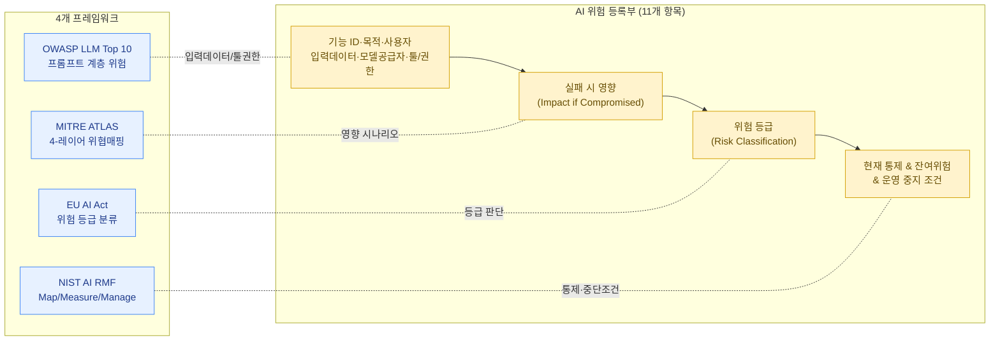

이 섹션의 4개 페이지(OWASP LLM Top 10, MITRE ATLAS, NIST AI RMF, EU AI Act)에서 배운 개념을 하나로 통합하는 실습입니다. 목표는 **회사(또는 가상의 시나리오)에서 사용 중인 AI 기능 하나를 골라, 그 위험을 한 장의 "위험 등록부(Risk Register)"로 구조화**하는 것입니다.


위험 등록부는 전통적인 보안/리스크 관리에서도 흔히 쓰는 산출물입니다. 다만 AI 위험 등록부는 "모델/데이터/에이전트 권한"이라는 AI 특화 항목을 추가로 다룬다는 점이 다릅니다. 이 실습은 거버넌스 섹션의 최종 산출물이자, 동시에 이 지식베이스 전체를 관통하는 통합 실습입니다.


## 왜 이 실습이 중요한가

AI 보안 관련 면접에서 가장 자주 받는 질문 중 하나는 다음과 같은 형태입니다.

> "우리 회사가 고객 응대용 RAG 챗봇을 도입하려고 합니다. 이 시스템에서 어떤 위험을 봐야 할까요?"

이 질문에 "프롬프트 인젝션이 위험합니다", "데이터 유출이 우려됩니다" 같은 단편적인 답변을 하는 사람은 많습니다. 하지만 "**이런 항목들을 이런 틀로 정리해서 보면 됩니다**"라며 구조화된 문서를 즉석에서(또는 미리 준비해서) 제시할 수 있는 사람은 거의 없습니다. 위험 등록부 작성 경험은 바로 이 차이를 만듭니다.

### AI 보안 프레임워크의 역할 구조

이 위험 등록부가 통합하는 4개 프레임워크는 각각 사용자가 던지는 서로 다른 질문에 대한 답입니다.

| 질문 (사용자 관점) | 프레임워크 | 핵심 역할 |
|---|---|---|
| "무엇을 조심해야 해?" | OWASP LLM Top 10 | 위험 식별 및 분류 (공격 유형 정의) |
| "공격자가 어떻게 들어와?" | MITRE ATLAS | 구체적 위협 동작 매핑 (공격 기술 지도) |
| "법적으로 어디까지 책임져야 해?" | EU AI Act | 위험 등급 분류 및 법적 준수 |
| "위험 관리는 어떻게 해?" | NIST AI RMF | 관리 단계 및 프로세스 (Map/Measure/Manage) |


**이해를 돕기 위한 보충 설명 (집 보안 비유)**

- **위험 식별 (OWASP)**: "우리 집에 도둑이 들 수 있는 구멍(창문, 문, 환풍구 등)"이 무엇인지 리스트를 뽑는 과정입니다.
- **위협 동작 (MITRE ATLAS)**: "도둑이 구체적으로 어떤 장비(도구)를 들고, 어떤 순서로 창문을 넘는지" 그 행동 패턴을 분석하는 것입니다.
- **법적 준수 (EU AI Act)**: "우리 집의 중요도에 따라 어떤 강화유리나 잠금장치를 법적으로 의무 설치해야 하는지"를 결정하는 기준입니다.
- **관리 단계 (NIST AI RMF)**: "이 모든 위험을 식별하고 방어하기 위해, 매일/매달 어떤 프로세스로 집을 점검하고 관리할 것인가"라는 전체적인 운영 가이드라인입니다.


## 위험 등록부 템플릿

아래 표는 AI 기능 1개당 작성해야 할 핵심 항목들입니다. 각 항목이 이 섹션의 어떤 프레임워크와 연결되는지도 함께 표시했습니다.

| 항목 | 설명 | 관련 프레임워크 |
|---|---|---|
| **기능 ID / 이름** | 위험 등록부 내에서 이 기능을 식별하는 고유 이름 | — |
| **기능 목적 (Purpose)** | 이 AI 기능이 무엇을 하는지, 왜 도입했는지 | [NIST AI RMF - Map](../../docs/governance/nist-ai-rmf/) |
| **사용자 (Users)** | 누가 사용하는가 (내부 직원 / 일반 고객 / 둘 다) | [NIST AI RMF - Map](../../docs/governance/nist-ai-rmf/), [EU AI Act](../../docs/governance/eu-ai-act/) (분류 기준) |
| **입력 데이터 (Input Data)** | 모델에 들어가는 데이터의 종류와 출처 (사용자 입력, RAG 문서, 외부 API 등) | [OWASP - 프롬프트 계층](../../docs/governance/owasp-llm-top10/) |
| **모델 공급자 (Model Provider)** | 어떤 모델/공급자를 사용하는가 (자체 호스팅 / 외부 API / 오픈소스) | [공급망 리스크](../../docs/infrastructure/supply-chain-risk/), [EU AI Act - GPAI](../../docs/governance/eu-ai-act/) |
| **툴/권한 (Tool & Permission Scope)** | 이 AI(에이전트)가 호출할 수 있는 도구와 그 권한 범위 | [OWASP - 권한/툴 실행 계층](../../docs/governance/owasp-llm-top10/) |
| **실패 시 영향 (Impact if Compromised)** | 이 기능이 오작동하거나 공격당했을 때 발생하는 비즈니스/안전 영향 | [MITRE ATLAS - Impact](../../docs/governance/mitre-atlas/), [EU AI Act - 위험 등급](../../docs/governance/eu-ai-act/) |
| **위험 등급 (Risk Classification)** | OWASP 항목 매핑 + EU AI Act 위험 등급 + 자체 우선순위(상/중/하) | [OWASP](../../docs/governance/owasp-llm-top10/), [EU AI Act](../../docs/governance/eu-ai-act/) |
| **현재 대응 통제 (Current Controls)** | 이미 적용된 기술적/운영적 통제 | [NIST AI RMF - Manage](../../docs/governance/nist-ai-rmf/) |
| **잔여 위험 및 추가 통제 (Residual Risk & Next Steps)** | 현재 통제로 충분하지 않은 부분과 향후 계획 | [NIST AI RMF - Measure/Manage](../../docs/governance/nist-ai-rmf/) |
| **운영 중지 조건 (Deactivation Trigger)** | 어떤 조건에서 이 기능을 즉시 중단하는가, 중단 권한자는 누구인가 | [NIST AI RMF - Manage](../../docs/governance/nist-ai-rmf/) |

## 위험 등록부 템플릿 설계 원리

이 템플릿이 단순히 "항목을 많이 모아놓은 표"가 아닌 이유는, 각 항목이 특정 프레임워크의 역할을 그대로 이어받도록 설계되었기 때문입니다. 즉 위험 등록부 한 장을 채우는 행위 자체가 4개 프레임워크를 순서대로 적용하는 과정이 됩니다.

### 템플릿의 설계 원리 (통합의 묘미)

| 위험 등록부 항목 | 담당하는 프레임워크 | 역할 (사용자/보안 담당자가 얻는 가치) |
|---|---|---|
| 기능 목적 / 사용자 | NIST AI RMF (Map) | AI 도입의 이유와 이해관계자를 명확히 규정 |
| 입력 데이터 / 툴 권한 | OWASP LLM Top 10 | 공격 표면(Attack Surface)과 취약점을 데이터 단위로 식별 |
| 실패 시 영향 | MITRE ATLAS (Impact) | 구체적인 위협 동작이 비즈니스에 미치는 타격 예측 |
| 위험 등급 | EU AI Act | 법적 규제 수준과 보안 강화 우선순위 결정 |
| 통제 및 중지 조건 | NIST AI RMF (Manage) | 사고 발생 시 즉각 대응 가능한 운영 가이드 확보 |

### 이 구조의 강력한 장점

- **파편화 방지**: 보안 팀에서 "OWASP 따로, EU AI Act 따로" 공부하고 관리하면 현업은 혼란스럽습니다. 이 템플릿은 실무자가 한눈에 볼 수 있는 통합 가시성을 제공합니다.
- **논리적 방어 체계**: "왜 이 보안 통제를 적용했나요?"라는 질문에, "OWASP의 위협 시나리오를 바탕으로 EU AI Act의 등급을 고려하여 NIST RMF 프로세스에 따라 방어 체계를 수립했습니다"라고 논리적으로 완벽한 답변이 가능해집니다.
- **확장성**: 새로운 AI 서비스가 나오면 이 템플릿의 11개 항목만 채우면 되므로, 표준화된 보안 거버넌스를 구축할 수 있습니다.

### 실무자를 위한 정리 팁 (위험 등록부 작성 전략)

이 연계성을 위험 등록부에 담을 때는 다음 "3단계 필터링"을 거치세요.

1. **현상 파악 (OWASP Top 10)**: "사용자가 입력을 통해 챗봇을 속이려 한다." (프롬프트 인젝션)
2. **구체적 위협 분석 (MITRE ATLAS)**: "속은 챗봇이 도구를 사용하여 민감 정보를 조회한다." (SSRF 기법)
3. **관리 및 책임 (NIST AI RMF & EU AI Act)**: "이 기능은 개인정보를 다루므로 '고위험'으로 분류하고, 대응 절차(중지 조건)를 수립한다."

이렇게 정리하면, 단순히 "보안이 중요하다"는 말을 넘어 "어떤 위협을, 어떤 프레임워크를 기준으로, 어떻게 관리하고 있는지"를 증명하는 포트폴리오가 됩니다.

## 작성 예시: 사내 고객지원 RAG 챗봇

아래는 "사내 문서 기반 고객지원 RAG 챗봇"이라는 가상의 AI 기능에 대해 위 템플릿을 채운 예시입니다. 실제로 실습할 때는 자신의 회사/프로젝트에 맞는 항목으로 교체하면 됩니다.

| 항목 | 작성 예시 |
|---|---|
| **기능 ID / 이름** | CS-CHATBOT-01: 고객지원 RAG 챗봇 |
| **기능 목적** | 고객이 자주 묻는 질문(환불 정책, 배송 안내 등)에 대해 사내 지식베이스 문서를 검색해 자동 응답 |
| **사용자** | 일반 고객 (외부, 비인증 사용자 포함) |
| **입력 데이터** | (1) 고객의 자연어 질문, (2) 벡터DB에 색인된 사내 정책/매뉴얼 문서(RAG), (3) 모델 API의 시스템 프롬프트 |
| **모델 공급자** | 외부 LLM API (제공자명, 모델 버전, 데이터 처리 정책 명시 필요) |
| **툴/권한** | 현재는 "문서 검색(read-only)"만 가능. 주문 조회 API 연동이 향후 계획에 포함되어 있음 (→ 권한 확장 시 재평가 필요) |
| **실패 시 영향** | (1) 잘못된 환불/배송 정보 안내로 고객 불만 및 법적 리스크, (2) RAG 인덱스에 포함된 내부 문서(가격 정책 등)가 프롬프트 인젝션을 통해 노출, (3) 향후 주문 조회 권한 연동 시, 인젝션을 통한 타 고객 주문정보 조회 가능성 |
| **위험 등급** | OWASP 매핑: LLM01(Prompt Injection), LLM02(Sensitive Information Disclosure), LLM08(Vector/Embedding) / EU AI Act: 현재는 "제한적 위험"(챗봇, 투명성 의무) — 단, 주문조회 연동 시 "고위험" 재검토 필요 / 내부 우선순위: 중 (연동 후 상으로 상향) |
| **현재 대응 통제** | (1) 시스템 프롬프트에 "내부 정책 문서 원문을 그대로 출력하지 말 것" 지시 포함, (2) 출력에 대한 키워드 기반 필터링, (3) RAG 인덱스 쓰기 권한은 콘텐츠팀으로 제한 |
| **잔여 위험 및 추가 통제** | 시스템 프롬프트 지시만으로는 [프롬프트 인젝션](../../docs/attacks/prompt-injection/) 방어에 충분하지 않음. 출력 구조화(JSON 스키마 강제) 및 별도 검증 레이어 추가 필요. 주문조회 연동 전 [LLM 레드티밍](../../docs/red-teaming/llm-red-teaming/) 수행 필수 |
| **운영 중지 조건** | (1) 동일 패턴의 인젝션 시도가 단시간 내 임계치 초과 시 자동으로 RAG 검색 기능 일시 중단, (2) 내부 정책 문서 노출이 1건이라도 확인되면 즉시 보안팀이 전체 챗봇 비활성화 권한 행사, (3) 재개 전 원인 분석 및 통제 보완 필수 |


위 예시는 학습용으로 단순화한 가상 시나리오입니다. 실제 작성 시에는 회사의 실제 아키텍처, 데이터 분류 정책, 법무 검토 결과를 반영해야 합니다. 또한 "위험 등급" 항목은 회사의 공식 위험관리 프로세스(있다면)와 충돌하지 않도록 표현을 조정하세요.


## 실습 진행 방법

1. **AI 기능 선정**: 본인이 알고 있는(또는 관심 있는) AI 기능 1개를 선택합니다. 실제 회사의 기능이 가장 좋지만, 없다면 "사내 RAG 챗봇", "코드 리뷰 에이전트", "이메일 자동 응답 에이전트" 같은 현실적인 가상 시나리오도 좋습니다.
2. **위 템플릿의 11개 항목을 모두 채웁니다.** 특히 "툴/권한"과 "실패 시 영향"은 추상적으로 쓰지 말고, 구체적인 도구 이름·API·데이터 종류를 명시하세요.
3. **MITRE ATLAS 매핑을 추가**해 보세요. [MITRE ATLAS](../../docs/governance/mitre-atlas/) 페이지의 4-레이어 모델(Environment / AI Platform / AI Model / AI Data)을 사용해, "실패 시 영향" 항목에 적은 시나리오가 어느 레이어/전술에 해당하는지 한 줄씩 덧붙입니다.
4. **EU AI Act 등급을 판단**해 보세요. [EU AI Act](../../docs/governance/eu-ai-act/) 페이지의 4단계 분류(금지/고위험/제한적 위험/최소 위험) 중 어디에 해당하는지, 그 근거를 한 문단으로 적습니다.
5. **운영 중지 조건을 반드시 포함**합니다. "이걸 누가, 언제, 어떻게 멈출 것인가"가 빠진 위험 등록부는 절반만 완성된 것입니다.

## 이 산출물이 포트폴리오/면접에서 강력한 이유

1. **실무에서 바로 쓰이는 형식**: 위험 등록부는 실제 보안팀, 컴플라이언스팀이 일상적으로 사용하는 문서 형식입니다. "이론을 배웠다"가 아니라 "실무 산출물을 만들어봤다"는 신호를 줍니다.
2. **여러 프레임워크를 통합했다는 증거**: OWASP, ATLAS, NIST AI RMF, EU AI Act를 각각 따로 아는 사람은 많지만, 이를 **하나의 문서로 통합**한 경험을 가진 사람은 드뭅니다. 이 통합 능력 자체가 "AI 위험을 구조화할 수 있는 사람"의 정의입니다.
3. **구체성이 신뢰를 만든다**: 면접에서 "AI 보안에 관심 있습니다"라고 말하는 대신, "제가 작성한 위험 등록부를 보여드리겠습니다"라고 하면 대화의 질이 완전히 달라집니다. 구체적인 도구명, 데이터 흐름, 중지 조건이 적힌 문서는 그 자체로 깊이를 증명합니다.
4. **확장 가능성**: 이 위험 등록부 1건을 만들고 나면, 같은 형식으로 회사의 다른 AI 기능들도 빠르게 채워나갈 수 있습니다. 즉 "1건의 산출물"이 아니라 "재사용 가능한 프로세스"를 만든 것이 됩니다.

다음 단계로, 실제 시스템에 대해 레드팀 관점의 시나리오를 검증해보고 싶다면 [레드팀·포트폴리오 프로젝트](../../docs/red-teaming/portfolio-projects/) 페이지에서 이 위험 등록부를 더 큰 포트폴리오 프로젝트로 확장하는 방법을 확인하세요.
